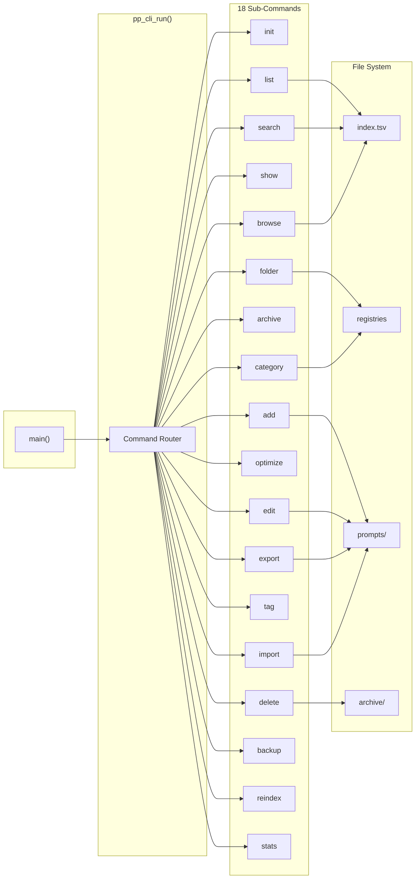
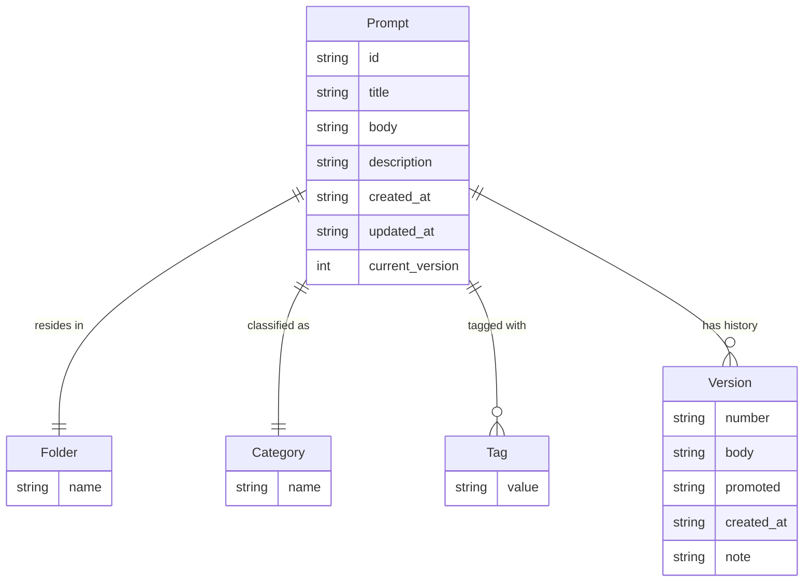
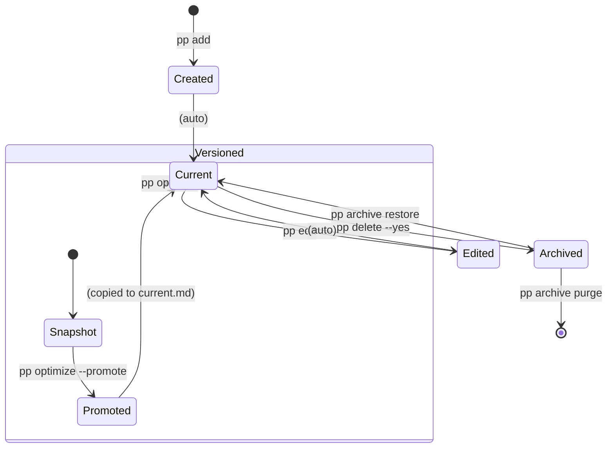
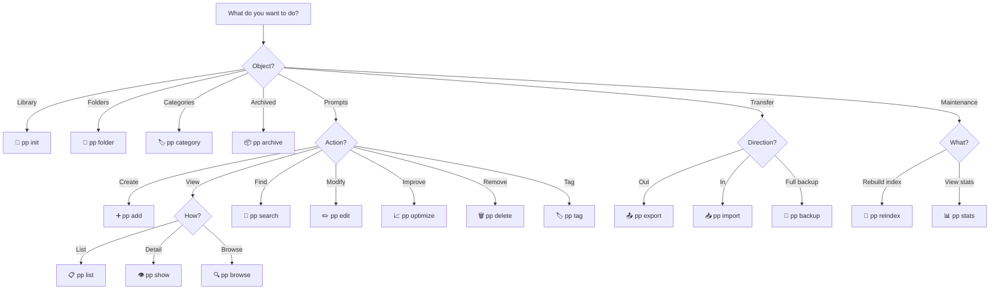
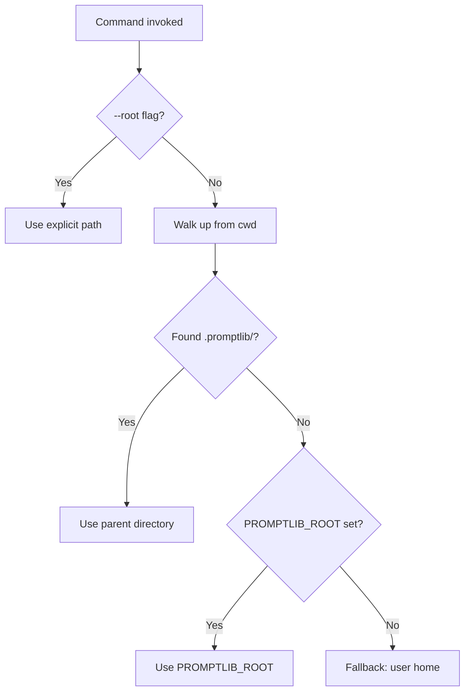
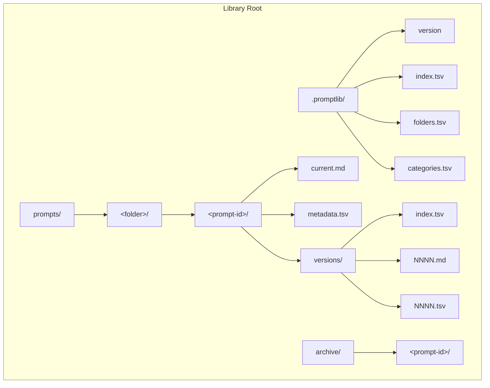

# Software Requirements Specification — PromptEditor

**Version:** 1.0 &nbsp;|&nbsp; **Date:** 2026-07-07 &nbsp;|&nbsp; **Status:** Draft

---

## Contents

- [1. Introduction](#1-introduction)
- [2. Overall Description](#2-overall-description)
- [3. Functional Requirements](#3-functional-requirements)
- [4. Storage Format](#4-storage-format)
- [5. Non-Functional Requirements](#5-non-functional-requirements)
- [6. Interface Specifications](#6-interface-specifications)
- [7. Appendices](#7-appendices)

---

## 1. Introduction

### 1.1 Purpose

PromptEditor is a pure C11 command-line application for saving, organizing, retrieving,
browsing, and improving prompt templates in a local file-backed library. This document
defines the functional and non-functional requirements for PromptEditor.

### 1.2 Scope

- A CLI executable (`pp`) with 18 sub-commands for prompt lifecycle management.
- A reusable C library (`prompteditor_core`) installable via CMake `find_package`.
- A human-readable, file-based storage format requiring no database server.
- Cross-platform support for Windows, Linux, and macOS on MSVC, GCC, Clang, and AppleClang.

### 1.3 System Architecture



### 1.4 Data Model



| Relationship | Cardinality | Constraint |
|-------------|:-----------:|------------|
| Prompt → Folder | 1:1 | Exactly one folder per prompt |
| Prompt → Category | 1:1 | Exactly one category per prompt |
| Prompt → Tag | 1:N | Zero or more tags |
| Prompt → Version | 1:N | Zero or more versioned snapshots |
| Folder ⊥ Category | orthogonal | Independent dimensions |

> **💡 Design Rationale:** Folders = where (exclusive container). Categories = what kind
> (functional type). Tags = what attributes (cross-cutting, multi-valued).

### 1.5 Prompt Lifecycle



### 1.6 Definitions

| Term | Definition |
|------|------------|
| Prompt | A text template identified by title, stored with metadata and version history |
| Library root | A directory containing `.promptlib/` and `prompts/` |
| Prompt ID | Sluggified title + 4-hex-digit hash suffix |
| Folder | Exclusive container; each prompt belongs to exactly one |
| Category | Functional type label; orthogonal to folder |
| Tag | Repeatable, comma-separated keyword for cross-cutting filtering |
| Registry | Name list stored as `.tsv` (folders, categories) |
| Index | Rebuildable TSV cache of prompt metadata |
| Version | Numbered (`NNNN`) snapshot created via `optimize` |
| Archive | `archive/` directory for deleted prompts |

### 1.7 Requirement Format

| Priority | Meaning |
|:--------:|---------|
| 🔴 P0 | Must implement — system unusable without it |
| 🟡 P1 | Should implement — absence significantly degrades usability |
| 🟢 P2 | Could implement — enhancement |

Each requirement is a `###` heading with ID, priority, and actor. The body uses a
code block with labeled fields (`Title`, `Desc`, `Given`, `When`, `Then`).
Implementation status is tracked in [§7.3 Planned Requirements](#73-planned-requirements), not inline.

---

## 2. Overall Description

### 2.1 Product Perspective

PromptEditor is a standalone CLI tool with no network dependency. It operates on
local files and ships as an installable C library.

### 2.2 User Characteristics

| Role | Description |
|------|-------------|
| **Any User** | Creates, organizes, and searches prompt templates |
| **Prompt Author** | Creates and edits prompt content |
| **Library Administrator** | Manages folders, categories, exports, imports, backups |
| **Script Author** | Consumes `pp` output via `--json` or `--raw` |
| **Downstream Developer** | Links `PromptEditor::prompteditor_core` |
| **Build Engineer** | Configures, builds, and installs the project |
| **QA Engineer** | Maintains and runs the test suite |
| **CI System** | Automated pipelines |
| **System** | Internal validation, integrity, behavior |

### 2.3 Operating Environment

Windows 10+, Linux (kernel 4.x+), macOS 11+. UTF-8 terminal; optional `fzf` and `$EDITOR`.

### 2.4 Design Constraints

Pure C11, zero external runtime dependencies. File I/O via standard C library.
CMake 3.21+; Ninja default. MSVC 2019+, GCC 8+, Clang 7+, AppleClang.

### 2.5 Assumptions

Filesystem supports POSIX `rename()` (atomic on same volume). Metadata fields contain
no tabs, newlines, or control characters. User has r/w access to the library root.

---

## 3. Functional Requirements

### Command Quick-Finder



### 3.1 Global CLI

| Flag | Global | Per-Command |
|------|:------:|:-----------:|
| `-h`, `--help` | ✅ | ✅ |
| `-v`, `--version` | ✅ | — |
| `--root <path>` | — | ✅ |

---

### REQ-F-001 🔴 [Any User]

```
Title  Global help
Desc   Running pp with no arguments, -h, or --help prints all available commands and
       global options.
Given  The pp executable is invoked with no arguments
When   The process starts
Then   stdout contains "Usage: pp <command> [options]" followed by all 18 commands
       and -h, --help / -v, --version; exit code is 0
```

---

### REQ-F-002 🔴 [Any User]

```
Title  Global version flag
Desc   Running pp -v or pp --version prints the CLI version string.
Given  pp is invoked with -v or --version
When   The argument is parsed
Then   stdout contains "pp <version>" and exit code is 0
```

---

### REQ-F-003 🔴 [Any User]

```
Title  Unknown command error
Desc   Running pp <unknown> prints an error and exits with code 1.
Given  The user invokes pp nonexistent
When   The command dispatcher runs
Then   stderr contains "Unknown command: nonexistent" and "Run 'pp --help' for
       usage."; exit code is 1
```

---

### REQ-F-004 🟡 [Any User]

```
Title  Command-specific help
Desc   Every sub-command supports -h / --help to print its own usage text.
Given  The user invokes pp add --help
When   The argument is parsed
Then   stdout contains the usage line, option list, and descriptions specific to add;
       exit code is 0
```

---

### 3.2 Library Root Discovery



---

### REQ-F-005 🔴 [Any User]

```
Title  Auto-discover library root
Desc   When --root is omitted, the CLI walks up from cwd looking for .promptlib/.
       The first directory containing it becomes the root.
Given  cwd is /home/user/projects/my-prompts/notes and .promptlib/ exists at
       /home/user/projects/my-prompts/.promptlib/
When   pp list is invoked without --root
Then   The library root resolves to /home/user/projects/my-prompts
```

---

### REQ-F-006 🔴 [Any User]

```
Title  PROMPTLIB_ROOT environment variable
Desc   If walk-up fails, PROMPTLIB_ROOT is used as the library root.
Given  PROMPTLIB_ROOT=/custom/prompts and no parent contains .promptlib/
When   pp list is invoked without --root
Then   The library root resolves to /custom/prompts
```

---

### REQ-F-007 🔴 [Any User]

```
Title  Default fallback to user home
Desc   If neither walk-up nor PROMPTLIB_ROOT yields a root, the user's home directory
       is used. init_library() creates .promptlib/ inside it.
Given  No parent contains .promptlib/ and PROMPTLIB_ROOT is unset
When   pp list is invoked
Then   The root defaults to $HOME (Unix) or %USERPROFILE% (Windows)
```

---

### REQ-F-008 🔴 [Any User]

```
Title  Explicit --root flag
Desc   --root <path> overrides auto-discovery and environment variables.
Given  pp list --root /explicit/path
When   The root is resolved
Then   The library root is /explicit/path
```

---

### 3.3 init — Initialize a Prompt Library

| Option | Required | Default | Description |
|--------|:--------:|---------|-------------|
| `--root <path>` | No | auto-discovered | Library root |

```sh
pp init                          # ~/.promptlib
pp init --root ./my-prompts      # ./my-prompts/.promptlib
```

---

### REQ-F-009 🔴 [Library Administrator]

```
Title  Initialize a new library
Desc   Creates .promptlib/, prompts/, archive/ and all required metadata files with
       default content.
Given  /tmp/mylib does not exist
When   pp init --root /tmp/mylib is executed
Then   .promptlib/version="1"; index.tsv has header; folders.tsv="name\ninbox\n";
       categories.tsv="name\ngeneral\n"; prompts/ and archive/ empty dirs;
       stdout="Prompt library ready: /tmp/mylib"; exit code 0
```

---

### REQ-F-010 🟡 [Library Administrator]

```
Title  init is idempotent
Desc   Re-running pp init on an initialized root does not overwrite existing metadata
       files.
Given  A fully initialized library at /tmp/mylib
When   pp init --root /tmp/mylib is executed again
Then   Existing files are unchanged; exit code is 0
```

---

### REQ-F-011 🟡 [Library Administrator]

```
Title  init creates missing only
Desc   On a partially-initialized root, only missing directories are created.
Given  /tmp/mylib/prompts/ exists but .promptlib/ does not
When   pp init --root /tmp/mylib is executed
Then   .promptlib/ and archive/ are created; prompts/ is left as-is
```

---

### 3.4 add — Save a Prompt

| Option | Required | Default | Notes |
|--------|:--------:|---------|-------|
| `--title <text>` | ✅ | — | < 512 chars, no tabs/newlines |
| `--body <text>` | * | — | Required unless `--editor` |
| `--editor` | No | — | Opens `$EDITOR` |
| `--folder <path>` | No | `inbox` | Auto-registered |
| `--category <name>` | No | `general` | Auto-registered |
| `--tag <name>` | No | — | Repeatable |
| `--description <text>` | No | — | Optional |

> \* `--body` is required unless `--editor` is used.

```sh
pp add --title "Summarize" --body "Summarize the following text."
pp add --title "Draft" --editor
pp add --title "Review" --body "..." --folder work --category instruction --tag ai --tag urgent
```

**Prompt ID generation**: slugify title (lowercase alphanumeric, non-alphanumeric → `-`,
trim edges), append `-` + last 4 hex of djb2 hash. Empty slug → `"p"`.

```
"Hello World! 2024"  →  hello-world-2024-a1b2
"!!!"                →  p-c3d4
```

---

### REQ-F-012 🔴 [Prompt Author]

```
Title  Add a prompt
Desc   Saves a new prompt, generating a stable ID and writing body, metadata, and
       index. Validates per [§3.21].
Given  An initialized library and pp add --title "Hello World" --body "Say hello."
When   The command executes
Then   prompts/inbox/<slug>-<hash>/ is created containing current.md ("Say hello.")
       and metadata.tsv (id, title, folder=inbox, category=general, timestamps,
       current_version=1); index.tsv appended; stdout "Saved prompt: <id>"; exit code 0
```

---

### REQ-F-013 🔴 [Prompt Author]

```
Title  Missing --title
Desc   pp add without --title prints an error and exits with code 1.
Given  pp add --body "text" without --title
When   Arguments are parsed
Then   stderr: "Missing required option: --title."; exit code 1
```

---

### REQ-F-014 🔴 [Prompt Author]

```
Title  Missing --body
Desc   pp add without --body and without --editor prints an error.
Given  pp add --title "Test"
When   Arguments are parsed
Then   stderr: "Missing required option: --body (or use --editor)."; exit code 1
```

---

### REQ-F-015 🟡 [Prompt Author]

```
Title  Add via $EDITOR
Desc   Opens the system editor with a pre-filled temporary file; saves edited content
       as body. Falls back to notepad (Win) / vi (Unix).
Given  $EDITOR is set and pp add --title "Draft" --editor is invoked
When   The editor exits successfully
Then   The edited content is saved as the prompt body; exit code is 0
```

---

### REQ-F-016 🟡 [Prompt Author]

```
Title  Editor non-zero exit
Desc   If the editor returns non-zero, the prompt is not saved.
Given  The editor exits with code 1
When   spawn_editor returns
Then   stderr: "Editor returned non-zero. Content not updated."; no prompt created;
       exit code 1
```

---

### REQ-F-017 🟡 [Prompt Author]

```
Title  Add with optional metadata
Desc   Supports --folder, --category, --tag (repeatable), --description.
Given  pp add --title "T" --body "B" --folder work --category coding --tag ai
       --tag review --description "A useful prompt"
When   The command executes
Then   Prompt saved with folder="work", category="coding", tags="ai,review",
       description="A useful prompt"; folder and category auto-registered
```

---

### REQ-F-018 🔴 [Prompt Author]

```
Title  Duplicate ID rejection
Desc   If a prompt with the same auto-generated ID already exists, the add fails.
Given  A prompt with title "Hello World" already exists (ID hello-world-xxxx)
When   pp add --title "Hello World" --body "B" is executed
Then   stderr: "Prompt already exists: hello-world-xxxx"; exit code 1
```

---

### REQ-F-019 🔴 [Prompt Author]

```
Title  Validate fields on add
Desc   All fields validated per [§3.21] before saving.
Given  Title exceeds 511 characters
When   Validation runs
Then   stderr indicates unsupported characters; exit code 1; prompt not created
```

---

### REQ-F-020 🔴 [System]

```
Title  Prompt ID generation
Desc   IDs are generated by slugifying the title (lowercase alphanumeric, non‑alphanumeric
       → "-", trim edges), then appending "-" + last 4 hex digits of a djb2 hash of the
       original title. Empty slug → "p".
Given  Title "Hello World! 2024" → "hello-world-2024-a1b2"; Title "!!!" → "p-c3d4"
When   pp add generates an ID
Then   IDs are stable (same title → same ID), lowercase, ≤ 128 chars, unique per title
```

---

### REQ-F-021 🔴 [System]

```
Title  Default metadata assignment
Desc   Omitted --folder defaults to "inbox"; omitted --category defaults to "general";
       omitted tags default to empty; omitted description defaults to empty.
       created_at / updated_at set to current UTC timestamp; current_version = 1.
Given  pp add --title "T" --body "B" with no optional flags
When   The prompt is saved
Then   metadata.tsv: folder=inbox, category=general, no tag rows, no description row,
       created_at/updated_at populated, current_version=1
```

---

### 3.5 list — List Prompts

| Option | Description |
|--------|-------------|
| `--folder <path>` | Filter by folder |
| `--category <name>` | Filter by category |
| `--tag <name>` | Filter by tag |
| `--json` | JSON array output |
| `--no-pager` | Disable auto-paging |

```sh
pp list                          # colored table
pp list --folder work --tag urgent  # combined filters
pp list --json                      # machine-readable
```

---

### REQ-F-022 🔴 [Any User]

```
Title  List as table
Desc   Prints a colored table (ID, TITLE, FOLDER, CATEGORY, TAGS) with prompt count.
       Respects NO_COLOR and auto-paging.
Given  A library with 2 prompts
When   pp list is executed
Then   Header row, separator, 2 data rows, and "2 prompt(s)"; exit code 0
```

---

### REQ-F-023 🟡 [Any User]

```
Title  List with auto-paging
Desc   When stdout is a TTY, output pipes through $PAGER (fallback: less -R / more).
       --no-pager disables this.
Given  stdout is a TTY and output exceeds one screen
When   pp list is executed without --no-pager
Then   Output is piped through the pager
```

---

### REQ-F-024 🟡 [Script Author]

```
Title  List as JSON
Desc   pp list --json prints a JSON array. Escapes per [REQ-F-092].
Given  A library with 1 prompt
When   pp list --json is executed
Then   stdout is valid JSON [{...}]; colors and paging suppressed
```

---

### REQ-F-025 🟡 [Any User]

```
Title  List filtered by folder
Desc   pp list --folder <path> shows only prompts in the specified folder.
Given  Prompts in "inbox" and "work"
When   pp list --folder work
Then   Only folder="work" prompts displayed
```

---

### REQ-F-026 🟡 [Any User]

```
Title  List filtered by category
Desc   pp list --category <name> shows only prompts with the specified category.
Given  Prompts with categories "general" and "coding"
When   pp list --category coding
Then   Only category="coding" prompts displayed
```

---

### REQ-F-027 🟡 [Any User]

```
Title  List filtered by tag
Desc   pp list --tag <name> shows only prompts with the specified tag.
Given  One prompt has tags "ai,review", another has "draft"
When   pp list --tag ai
Then   Only the prompt with tag "ai" displayed
```

---

### REQ-F-028 🟡 [Any User]

```
Title  List with combined filters
Desc   Multiple filter flags combine with AND logic.
Given  Prompts in various folder/category/tag combinations
When   pp list --folder work --tag urgent
Then   Only prompts matching ALL filters displayed
```

---

### REQ-F-029 🟡 [Any User]

```
Title  List empty library
Desc   When the library has no prompts, a placeholder message is shown.
Given  A library with zero prompts
When   pp list is executed
Then   stdout: "(empty)"; exit code 0
--
Given  pp list --json on an empty library
Then   stdout: "[\n\n]" (empty JSON array); exit code 0
```

---

### 3.6 show — Display a Prompt

| Option | Description |
|--------|-------------|
| `<id-or-title>` | Prompt ID or exact title |
| `--raw` | Body only |
| `--json` | JSON object |

```sh
pp show hello-world-a1b2          # by ID
pp show "Hello World"             # by title
pp show hello-world-a1b2 --raw    # body only
```

---

### REQ-F-030 🔴 [Any User]

```
Title  Show by ID or title
Desc   Displays metadata and body. Matches by exact ID first, then exact title.
Given  A prompt with ID "hello-world-a1b2" exists
When   pp show hello-world-a1b2 is executed
Then   stdout contains ID, Title, Folder, Category, Tags, body, separators; exit
       code 0. Matching by title produces identical output.
```

---

### REQ-F-031 🔴 [Any User]

```
Title  Prompt not found
Desc   If no prompt matches the given ID or title, an error is printed.
Given  No prompt matches "nonexistent"
When   pp show nonexistent is executed
Then   stderr: "Prompt not found: nonexistent"; exit code 1
```

---

### REQ-F-032 🟡 [Script Author]

```
Title  Show raw body
Desc   pp show <id> --raw prints only the body text.
Given  A prompt with body "Translate this text."
When   pp show <id> --raw is executed
Then   stdout contains exactly "Translate this text."; exit code 0
```

---

### REQ-F-033 🟡 [Script Author]

```
Title  Show as JSON
Desc   pp show <id> --json prints a JSON object. Escapes per [REQ-F-092].
Given  A prompt body contains double quotes and newlines
When   pp show <id> --json is executed
Then   stdout is valid JSON with escaped special characters; exit code 0
```

---

### 3.7 edit — Update a Prompt

| Option | Notes |
|--------|-------|
| `<id-or-title>` | Prompt to edit |
| `--body <text>` | Replace body inline |
| `--title <text>` | Replace title |
| `--category <name>` | Replace category |
| `--folder <path>` | Move to different folder |
| `--tag <name>` | Replace all tags; repeatable |
| `--description <text>` | Replace description |

> **Editor mode**: If no flag is given, opens `$EDITOR` with the current body.

```sh
pp edit hello-world-a1b2                            # editor mode
pp edit hello-world-a1b2 --body "Updated text"      # inline
pp edit hello-world-a1b2 --folder work              # move folder
pp edit hello-world-a1b2 --tag urgent --tag ai      # replace tags
```

---

### REQ-F-034 🔴 [Prompt Author]

```
Title  Edit via $EDITOR
Desc   Opens $EDITOR with the current body. On success, the edited content replaces
       the body.
Given  A prompt with body "Original text"
When   pp edit <id> is executed and the editor saves "Updated text"
Then   Body replaced; updated_at refreshed; index updated; stdout "Updated prompt:
       <id>"; exit code 0
```

---

### REQ-F-035 🟡 [Prompt Author]

```
Title  Edit body inline
Desc   pp edit <id> --body <text> replaces the body directly.
Given  A prompt with body "Old"
When   pp edit <id> --body "New" is executed
Then   Body becomes "New"; updated_at refreshed; exit code 0
```

---

### REQ-F-036 🟡 [Prompt Author]

```
Title  Edit metadata fields
Desc   Supports --title, --category, --tag, --description, --folder. Validates per
       [§3.21].
Given  A prompt with title "Old Title" and category "general"
When   pp edit <id> --title "New Title" --category "coding"
Then   Both metadata.tsv and index updated; exit code 0
```

---

### REQ-F-037 🟡 [Prompt Author]

```
Title  Tag replacement
Desc   --tag replaces all existing tags (not appends). Use pp tag add for incremental.
Given  A prompt with tags "ai,review"
When   pp edit <id> --tag urgent
Then   Tags become "urgent"; exit code 0
```

---

### REQ-F-038 🟡 [Prompt Author]

```
Title  Edit moves folder
Desc   pp edit <id> --folder <new-folder> updates the folder. New folder auto-registered.
Given  A prompt in folder "inbox"
When   pp edit <id> --folder work
Then   Folder updated in metadata and index; exit code 0
```

---

### REQ-F-039 🟡 [Prompt Author]

```
Title  Edit validates fields
Desc   All edited fields validated per [§3.21].
Given  pp edit <id> --folder "../../etc"
When   Validation runs
Then   stderr: "Folder contains unsupported characters."; prompt unchanged; exit code 1
```

---

### 3.8 delete — Archive or Remove a Prompt

| Option | Description |
|--------|-------------|
| `<id-or-title>` | Prompt to delete |
| `--yes` | Confirm the operation |

```sh
pp delete hello-world-a1b2 --yes
```

---

### REQ-F-040 🔴 [Prompt Author]

```
Title  Delete archives prompt
Desc   Moves the prompt directory from prompts/<folder>/<id> to archive/<id> and
       removes its index row.
Given  A prompt exists at prompts/inbox/summarize-a1b2/
When   pp delete summarize-a1b2 --yes is executed
Then   Directory moved to archive/summarize-a1b2/; index row removed; stdout
       "Archived prompt: summarize-a1b2"; exit code 0
```

---

### REQ-F-041 🔴 [Prompt Author]

```
Title  Delete needs confirmation
Desc   Without --yes, a confirmation message is printed and nothing is deleted.
Given  A prompt exists
When   pp delete <id> without --yes
Then   stderr: "Delete archives prompts. Re-run with --yes to confirm."; exit code 1
```

---

### REQ-F-042 🟡 [Prompt Author]

```
Title  Reject duplicate archive
Desc   If an archived prompt with the same ID exists, delete is rejected.
Given  archive/summarize-a1b2/ already exists
When   pp delete summarize-a1b2 --yes
Then   stderr: "Archived prompt already exists: summarize-a1b2"; exit code 1
```

---

### 3.9 archive — Manage Archived Prompts

| Action | Syntax | Requires `--yes` |
|--------|--------|:---:|
| `list` | `pp archive list` | — |
| `restore` | `pp archive restore <id>` | — |
| `purge` | `pp archive purge <id> --yes` | ✅ |

```sh
pp archive list
pp archive restore hello-world-a1b2
pp archive purge hello-world-a1b2 --yes
```

---

### REQ-F-125 🟡 [Prompt Author]

```
Title  List archived prompts
Desc   Lists all prompts in the archive/ directory.
Given  3 prompts have been archived
When   pp archive list
Then   Table of archived prompts (ID, title, archived date); exit code 0
```

---

### REQ-F-126 🟡 [Prompt Author]

```
Title  Restore archived prompt
Desc   Restores an archived prompt to its original folder (or inbox if original no
       longer exists), re-adding it to the index.
Given  An archived prompt "summarize-a1b2" exists in archive/
When   pp archive restore summarize-a1b2
Then   Directory moved back to prompts/<folder>/summarize-a1b2/; re-added to index;
       exit code 0
```

---

### REQ-F-127 🟡 [Prompt Author]

```
Title  Purge archived prompt
Desc   Permanently deletes an archived prompt from the filesystem.
Given  An archived prompt exists
When   pp archive purge <id> --yes
Then   Prompt directory permanently deleted from archive/; exit code 0
```

---

### 3.10 search — Full-Text Search

| Option | Description |
|--------|-------------|
| `<query>` | Case-insensitive search term |
| `--folder/category/tag` | Pre-filters |
| `--raw` | Body-only output |

```sh
pp search chinese
pp search "code review" --folder work
pp search chinese --raw
```

---

### REQ-F-044 🔴 [Any User]

```
Title  Search all fields
Desc   Case-insensitive substring matching across ID, title, folder, category, tags,
       and body.
Given  One prompt titled "Translate to Chinese", another with body "Chinese"
When   pp search chinese
Then   Both prompts listed; exit code 0
```

---

### REQ-F-045 🟡 [Any User]

```
Title  Search with raw output
Desc   pp search <query> --raw prints only matching bodies.
Given  2 prompts match
When   pp search <query> --raw
Then   stdout contains only body text; exit code 0
```

---

### REQ-F-046 🟡 [Any User]

```
Title  Search with filters
Desc   Supports --folder, --category, --tag pre-filters.
Given  Matching prompts in both "inbox" and "work"
When   pp search test --folder work
Then   Only "work" matches displayed
```

---

### REQ-F-047 🟡 [Any User]

```
Title  Search no results
Desc   When no prompts match, "No prompts found." (suppressed in raw mode).
Given  No prompt contains "xyznonexistent"
When   pp search xyznonexistent
Then   "No prompts found."; exit code 0
```

---

### 3.11 browse — Interactive Prompt Browser

| Option | Description |
|--------|-------------|
| `--folder/category/tag` | Pre-filter |

```sh
pp browse
pp browse --folder work
```

---

### REQ-F-048 🔴 [Any User]

```
Title  Browse with fzf
Desc   When fzf is on PATH, launches interactive fuzzy-finder with preview (pp show
       --raw).
Given  fzf is on PATH and library has prompts
When   pp browse
Then   fzf launches with titles and preview; exit code 0
```

---

### REQ-F-049 🔴 [Any User]

```
Title  Browse numbered menu fallback
Desc   When fzf is unavailable, displays a numbered list. Enter number to view, 'e'
       to edit, 'q' to quit.
Given  fzf not on PATH, library with 3 prompts
When   pp browse
Then   Numbered list shown; entering "1" shows that prompt; "q" quits; exit code 0
```

---

### REQ-F-050 🟡 [Any User]

```
Title  Browse with filters
Desc   Supports --folder, --category, --tag pre-filters.
Given  Prompts in multiple folders
When   pp browse --folder work
Then   Only "work" prompts appear
```

---

### REQ-F-051 🟡 [Any User]

```
Title  Browse edit shortcut
Desc   In numbered-menu mode, press 'e' after viewing to edit that prompt.
Given  A prompt is shown in numbered menu
When   User presses 'e'
Then   pp edit <id> invoked; returns to browser after
```

---

### 3.12 optimize — Prompt Versioning

| Option | Notes |
|--------|-------|
| `<id-or-title>` | Prompt to optimize |
| `--body <text>` | Required * |
| `--note <text>` | Change rationale |
| `--promote` | Make new version current |
| `--history` | List all versions |
| `--compare <version>` | Compare with version |

> \* Required unless `--history` or `--compare` is used.

```sh
pp optimize hello-world-a1b2 --body "Better version" --note "Improved clarity"
pp optimize hello-world-a1b2 --body "Final" --promote
pp optimize hello-world-a1b2 --history
pp optimize hello-world-a1b2 --compare 0002
```

---

### REQ-F-052 🔴 [Prompt Author]

```
Title  Create optimized version
Desc   Creates a new version snapshot under versions/ without modifying current.md.
Given  A prompt with current version 1 (body "Original")
When   pp optimize <id> --body "Improved" --note "Better wording"
Then   versions/0002.md="Improved"; versions/index.tsv appended; current.md
       unchanged; stdout "Created optimized version: 0002"; exit code 0
```

---

### REQ-F-053 🔴 [Prompt Author]

```
Title  Optimize requires --body
Desc   Without --body, --history, or --compare, an error is printed.
Given  pp optimize <id> without any action flag
When   Arguments are parsed
Then   stderr: "Missing required option: --body."; exit code 1
```

---

### REQ-F-054 🟡 [Prompt Author]

```
Title  Promote a version
Desc   --promote creates the version and copies it to current.md.
Given  A prompt with current version 1
When   pp optimize <id> --body "Promoted" --promote
Then   current.md="Promoted"; current_version=0002; stdout "Created and promoted
       optimized version: 0002"; exit code 0
```

---

### REQ-F-055 🟡 [Prompt Author]

```
Title  Show version history
Desc   pp optimize <id> --history prints versions/index.tsv.
Given  A prompt with versions 0002, 0003
When   pp optimize <id> --history
Then   stdout contains version rows. With no versions: "No optimized versions found."
```

---

### REQ-F-056 🟡 [Prompt Author]

```
Title  Compare with a version
Desc   pp optimize <id> --compare <version> prints current and specified version bodies.
Given  Current body="Current", version 0002 body="Version 2"
When   pp optimize <id> --compare 0002
Then   stdout contains both bodies; exit code 0
```

---

### REQ-F-057 🟡 [Prompt Author]

```
Title  Auto-increment version
Desc   Version numbers auto-increment from highest existing. First is 0002.
Given  A prompt with versions 0002, 0003
When   pp optimize <id> --body "New"
Then   New version is 0004
```

---

### 3.13 folder — Manage Folders

| Action | Syntax | Requires `--yes` |
|--------|--------|:---:|
| `list` | `pp folder list` | — |
| `create` | `pp folder create <name>` | — |
| `remove` | `pp folder remove <name> --yes` | ✅ |
| `rename` | `pp folder rename <name> --to <new-name>` | — |

---

### REQ-F-059 🔴 [Library Administrator]

```
Title  List folders
Desc   Prints all registered folder names.
Given  "inbox" and "work" folders exist
When   pp folder list
Then   stdout: "name", "inbox", "work"; exit code 0
```

---

### REQ-F-060 🔴 [Library Administrator]

```
Title  Create a folder
Desc   Adds a new folder name; idempotent. Validates per [REQ-F-091].
Given  Folder "projects" does not exist
When   pp folder create projects
Then   "projects" appended to folders.tsv; stdout "Created folder: projects";
       exit code 0
```

---

### REQ-F-062 🔴 [Library Administrator]

```
Title  Remove a folder
Desc   Removes from registry only if no prompts reference it.
Given  "empty-folder" has no prompts
When   pp folder remove empty-folder --yes
Then   stdout "Removed folder: empty-folder"; exit code 0
--
Given  "inbox" has prompts
When   pp folder remove inbox --yes
Then   stderr "Cannot remove folder 'inbox' while prompts still use it."; exit code 1
```

---

### REQ-F-063 🔴 [Library Administrator]

```
Title  Remove needs confirmation
Desc   Without --yes, prints a confirmation message.
Given  Folder "test" exists
When   pp folder remove test without --yes
Then   stderr "Re-run with --yes to remove folder 'test'."; exit code 1
```

---

### REQ-F-064 🟡 [Library Administrator]

```
Title  Rename a folder
Desc   Renames in registry, updates all referencing prompts, renames directory on disk.
Given  Folder "old-name" with prompts and prompts/old-name/
When   pp folder rename old-name --to new-name
Then   Registry, index, metadata, and directory all updated; exit code 0
```

---

### REQ-F-065 🔴 [Library Administrator]

```
Title  Validate folder names
Desc   Validates per [REQ-F-091].
Given  pp folder create "../escape"
When   Validation runs
Then   stderr "folder name contains unsupported characters."; exit code 1
```

---

### 3.14 category — Manage Categories

| Action | Syntax | Requires `--yes` |
|--------|--------|:---:|
| `list` | `pp category list` | — |
| `create` | `pp category create <name>` | — |
| `remove` | `pp category remove <name> --yes` | ✅ |
| `rename` | `pp category rename <name> --to <new-name>` | — |

---

### REQ-F-066 🔴 [Library Administrator]

```
Title  List categories
Desc   Prints all registered category names.
Given  An initialized library
When   pp category list
Then   stdout: "name", "general" (plus registered); exit code 0
```

---

### REQ-F-067 🔴 [Library Administrator]

```
Title  Create a category
Desc   Adds new category; idempotent. Validates per [REQ-F-086].
Given  Category "writing" does not exist
When   pp category create writing
Then   stdout "Created category: writing"; exit code 0
```

---

### REQ-F-068 🔴 [Library Administrator]

```
Title  Remove a category
Desc   Removes from registry if no prompts reference it.
Given  "obsolete" has no prompts
When   pp category remove obsolete --yes
Then   stdout "Removed category: obsolete"; exit code 0
--
Given  "general" is in use
When   pp category remove general --yes
Then   stderr "Cannot remove category 'general' while prompts still use it."; exit code 1
```

---

### REQ-F-069 🟡 [Library Administrator]

```
Title  Rename a category
Desc   Renames in registry and updates all referencing prompts.
Given  Category "ai" used by 3 prompts
When   pp category rename ai --to artificial-intelligence
Then   Registry updated; all 3 prompts updated; stdout "Renamed category: ai ->
       artificial-intelligence"; exit code 0
```

---

### REQ-F-070 🔴 [Library Administrator]

```
Title  Validate category names
Desc   Validates per [REQ-F-086].
Given  pp category create "cat\twith\ttab"
When   Validation runs
Then   stderr indicates unsupported characters; exit code 1
```

---

### 3.15 tag — Incremental Tag Management

| Action | Syntax | Description |
|--------|--------|-------------|
| `add` | `pp tag add <id> <tag>` | Append tag (no-op if present) |
| `remove` | `pp tag remove <id> <tag>` | Remove single tag |
| `list` | `pp tag list <id>` | List all tags |

Unlike `pp edit --tag` (replace all), `pp tag` operates on individual tags.

```sh
pp tag add hello-world-a1b2 urgent
pp tag remove hello-world-a1b2 draft
pp tag list hello-world-a1b2
```

---

### REQ-F-128 🟡 [Prompt Author]

```
Title  Add a tag
Desc   Appends a single tag. Idempotent if already present. Validates per [REQ-F-089].
Given  A prompt with tags "ai,review"
When   pp tag add <id> urgent
Then   Tags become "ai,review,urgent"; index and metadata updated; exit code 0
--
Given  Tag "urgent" already present
When   pp tag add <id> urgent
Then   Tags unchanged; exits successfully
```

---

### REQ-F-129 🟡 [Prompt Author]

```
Title  Remove a tag
Desc   Removes a single tag. No-op if not present.
Given  A prompt with tags "ai,review,urgent"
When   pp tag remove <id> review
Then   Tags become "ai,urgent"; index and metadata updated; exit code 0
```

---

### REQ-F-130 🟡 [Any User]

```
Title  List tags for a prompt
Desc   Prints all tags for the specified prompt, one per line.
Given  A prompt with tags "ai,review,urgent"
When   pp tag list <id>
Then   stdout: "ai\nreview\nurgent\n"; exit code 0
```

---

### 3.16 export — Export Prompts

| Option | Required | Description |
|--------|:--------:|-------------|
| `--out <path>` | ✅ | Destination |
| `--folder <path>` | No | Filter by folder |

```sh
pp export --out /tmp/exported
pp export --out /tmp/exported --folder work
```

---

### REQ-F-071 🔴 [Library Administrator]

```
Title  Export all prompts
Desc   Creates a new library at destination with all prompts, metadata, and versions.
Given  A library with 3 prompts
When   pp export --out /tmp/exported
Then   /tmp/exported/ is a valid library; stdout "Exported prompts: 3"; exit code 0
```

---

### REQ-F-072 🔴 [Library Administrator]

```
Title  Export refuses overwrite
Desc   If the output directory already exists, export fails.
Given  /tmp/exported already exists
When   pp export --out /tmp/exported
Then   stderr "Output directory already exists: /tmp/exported"; exit code 1
```

---

### REQ-F-073 🟡 [Library Administrator]

```
Title  Export filtered by folder
Desc   pp export --out <path> --folder <path> exports only that folder's prompts.
Given  Prompts in "inbox" and "work"
When   pp export --out /tmp/exported --folder work
Then   Only "work" prompts exported
```

---

### 3.17 import — Import Prompts

| Option | Required | Default | Description |
|--------|:--------:|---------|-------------|
| `<source-path>` | ✅ | — | Source library |
| `--on-conflict` | No | `skip` | `skip` or `replace` |

```sh
pp import /tmp/source
pp import /tmp/source --on-conflict replace
```

---

### REQ-F-076 🔴 [Library Administrator]

```
Title  Import prompts
Desc   Imports all prompts with bodies, metadata, and versions. Source must be valid
       per [REQ-F-079].
Given  Source at /tmp/source with 2 prompts
When   pp import /tmp/source
Then   Both prompts copied; index appended; folders/categories auto-registered;
       stdout "Imported prompts: 2"; exit code 0
```

---

### REQ-F-077 🔴 [Library Administrator]

```
Title  Import skip on conflict
Desc   Default --on-conflict skip: prompts with existing IDs are skipped.
Given  "hello-a1b2" exists in target and source
When   pp import /tmp/source
Then   Existing unchanged; source skipped; "Skipped prompts: 1"; exit code 0
```

---

### REQ-F-078 🟡 [Library Administrator]

```
Title  Import replace on conflict
Desc   --on-conflict replace overwrites existing prompts.
Given  "hello-a1b2" exists in target
When   pp import /tmp/source --on-conflict replace
Then   Body, metadata, versions replaced; counted as imported; exit code 0
```

---

### REQ-F-079 🟡 [Library Administrator]

```
Title  Import validates source
Desc   Source must be a valid library root (contains .promptlib/index.tsv).
Given  /tmp/not-a-library has no .promptlib/index.tsv
When   pp import /tmp/not-a-library
Then   stderr indicates invalid root; exit code 1
```

---

### 3.18 backup — Create a Full Backup

| Option | Required | Description |
|--------|:--------:|-------------|
| `--out <path>` | ✅ | Destination |

```sh
pp backup --out /tmp/backup-2026-07-07
```

---

### REQ-F-081 🔴 [Library Administrator]

```
Title  Backup entire library
Desc   Equivalent to pp export --out <path> with no filter.
Given  A library with 10 prompts across folders
When   pp backup --out /tmp/backup
Then   /tmp/backup/ is a complete, restorable copy; exit code 0
```

---

### 3.19 reindex — Rebuild the Prompt Index

| Option | Required | Description |
|--------|:--------:|-------------|
| `--root <path>` | No | Library root |
| `--dry-run` | No | Preview changes without writing |

```sh
pp reindex
pp reindex --dry-run
```

---

### REQ-F-131 🔴 [System]

```
Title  Rebuild index from metadata
Desc   Scans every metadata.tsv under prompts/ and regenerates index.tsv. Missing
       metadata.tsv → warning and skip. Implements [REQ-F-083].
Given  index.tsv has stale or incorrect entries
When   pp reindex is executed
Then   index.tsv regenerated with exactly one row per valid prompt; summary printed;
       exit code 0
```

---

### REQ-F-132 🟡 [Library Administrator]

```
Title  Reindex dry-run
Desc   pp reindex --dry-run prints differences without writing.
Given  index.tsv has 5 rows but only 3 valid prompt dirs
When   pp reindex --dry-run
Then   stdout lists 2 rows to remove and any missing; index.tsv unchanged; exit code 0
```

---

### 3.20 stats — Library Statistics

| Option | Description |
|--------|-------------|
| `--json` | JSON object output |

```sh
pp stats
pp stats --json
```

---

### REQ-F-133 🟢 [Any User]

```
Title  Display library statistics
Desc   Displays: prompt count, folder count, category count, unique tag count,
       versioned snapshot count, archived prompt count, disk usage.
Given  A library with 47 prompts, 5 folders, 3 categories, 12 tags, 8 versions,
       3 archived
When   pp stats
Then   Formatted summary with all counts and disk usage; exit code 0
--
Given  pp stats --json
Then   Valid JSON: {prompts, folders, categories, tags, versions, archived,
       disk_usage_bytes}
```

---

### 3.21 Validation Rules

> **💡 Design Rationale:** All user-supplied values pass through a common validation layer
> before being written to disk, ensuring consistency across all commands.

---

### REQ-F-082 🔴 [System]

```
Title  Atomic file writes
Desc   All file writes replacing content use write-to-temp-then-rename.
Given  A file write for current.md
When   The write executes
Then   Content written to current.md.tmp first; on success, original replaced via rename()
```

---

### REQ-F-083 🔴 [System]

```
Title  Index is rebuildable
Desc   index.tsv is a cache; metadata.tsv per prompt is source of truth. See
       [REQ-F-131] for the rebuild command.
Given  index.tsv is deleted
When   pp reindex is executed
Then   All metadata restored from individual metadata.tsv files
```

---

### REQ-F-084 🟡 [System]

```
Title  Metadata required keys
Desc   Every metadata.tsv must contain: id, title, folder, category, created_at,
       updated_at, current_version. Optional: tag, description.
```

---

### REQ-F-085 🟡 [System]

```
Title  Registry header preserved
Desc   folders.tsv and categories.tsv have "name" as header line; operations preserve it.
```

---

### REQ-F-086 🔴 [System]

```
Title  Unsupported character rejection
Desc   Metadata fields must not contain \t, \n, or \r.
Given  pp add --title "Title\nWith\nNewlines" --body "B"
When   Validation runs
Then   Command fails; stderr indicates unsupported characters
```

---

### REQ-F-087 🔴 [System]

```
Title  Field length limit
Desc   Metadata fields must be < 512 characters (PP_FIELD_MAX).
Given  A title of 512+ characters
When   pp add is invoked
Then   Command fails with validation error
```

---

### REQ-F-088 🔴 [System]

```
Title  Body length limit
Desc   Body text must be < 65536 characters (PP_BODY_MAX).
Given  A body exceeding 65535 characters
When   Read/write operations occur
Then   Content truncated or operation fails gracefully
```

---

### REQ-F-089 🔴 [System]

```
Title  Tag comma restriction
Desc   Individual tag values must not contain commas (comma = list separator in index).
Given  pp add --title "T" --body "B" --tag "ai,review"
When   Validation runs
Then   stderr: "Tag contains unsupported characters."; exit code 1
```

---

### REQ-F-090 🔴 [System]

```
Title  Version name format
Desc   Version names must be exactly 4 decimal digits (0002–9999).
Given  "abc" → returns 0 (invalid); "0002" → returns 1 (valid)
```

---

### REQ-F-091 🔴 [System]

```
Title  Folder path safety
Desc   Folder paths must not contain .., must not start with / or \, must not
       contain :.
Given  pp add --title "T" --body "B" --folder "../../escape"
When   path_has_unsafe_segment is called
Then   Returns 1 (unsafe); command fails
```

---

### 3.22 JSON Output

### REQ-F-092 🟡 [Script Author]

```
Title  JSON string escaping
Desc   Escapes ", \, \n, \t, \r; skips control characters below 0x20.
Given  A body containing He said "hello" and a newline
When   pp show <id> --json
Then   Body field: "He said \"hello\"\n..."; overall JSON valid
```

---

### REQ-F-093 🟡 [Script Author]

```
Title  List JSON valid array
Desc   pp list --json produces a valid JSON array.
Given  0 prompts → [\n\n]; 2 prompts → valid array with 2 objects
```

---

### 3.23 Terminal Output

### REQ-F-094 🟡 [System]

```
Title  NO_COLOR compliance
Desc   When NO_COLOR is set, no ANSI escape sequences are emitted.
Given  NO_COLOR=1 and stdout is a TTY
When   pp list
Then   Output contains no \x1b[... sequences
```

---

### REQ-F-095 🟡 [System]

```
Title  No color when not TTY
Desc   Color codes suppressed when output is redirected.
Given  stdout is a regular file
When   pp list > output.txt
Then   output.txt contains no ANSI escape sequences
```

---

### 3.24 Environment Variables

| Variable | Purpose | Fallback |
|----------|---------|----------|
| `PROMPTLIB_ROOT` | Default library root | User home |
| `EDITOR` | Editor for body | `notepad` / `vi` |
| `PAGER` | Pager for long output | `more` / `less -R` |
| `NO_COLOR` | Disable ANSI colors | (enabled) |

### REQ-F-096 🔴 [System] — PROMPTLIB_ROOT — See [REQ-F-006].

### REQ-F-097 🟡 [System] — EDITOR — See [REQ-F-015].

### REQ-F-098 🟡 [System] — PAGER — See [REQ-F-023].

### REQ-F-099 🟡 [System] — NO_COLOR — See [REQ-F-094].

---

### 3.25 Public C API

### REQ-F-100 🔴 [Downstream Developer]

```
Title  Library version query
Desc   pp_version() returns {major, minor, patch}.
Given  Library compiled with 0.1.0 → returns {0, 1, 0}
```

---

### REQ-F-101 🔴 [Downstream Developer]

```
Title  Checked integer addition
Desc   pp_add_checked(a, b, &result) returns 1 on success, 0 on overflow/NULL.
Given  pp_add_checked(2, 3, &v) → 1, v=5
Given  pp_add_checked(INT_MAX, 1, &v) → 0 (overflow)
```

---

### REQ-F-102 🟡 [Downstream Developer]

```
Title  Platform name
Desc   pp_platform_name() returns "windows", "macos", "linux", or "unknown".
```

---

### REQ-F-103 🔴 [Downstream Developer]

```
Title  C++ header compatibility
Desc   All public headers wrapped with extern "C". No C++ linkage errors.
```

---

### REQ-F-104 🟡 [Downstream Developer]

```
Title  DLL export on Windows
Desc   BUILD_SHARED_LIBS=ON + _WIN32: __declspec(dllexport/dllimport).
```

---

### 3.26 Build System

### REQ-F-105 🔴 [Build Engineer]

```
Title  Ninja CMake presets
Desc   Provides ninja-debug, ninja-release, ninja-shared, ninja-asan, ninja-coverage.
```

### REQ-F-106 🔴 [Build Engineer]

```
Title  Generator-neutral presets
Desc   debug, release, shared, asan, coverage presets work with any CMake generator.
```

### REQ-F-107 🔴 [Build Engineer]

```
Title  Installable CMake package
Desc   cmake --install → find_package(PromptEditor CONFIG REQUIRED) downstream.
```

### REQ-F-108 🟡 [Build Engineer]

```
Title  Top-level options ON
Desc   PP_BUILD_EXAMPLE, PP_BUILD_TESTING, PP_INSTALL default ON for top-level builds.
```

### REQ-F-109 🟡 [Build Engineer]

```
Title  Subproject options OFF
Desc   Same options default OFF when included via add_subdirectory().
```

### REQ-F-110 🟡 [Build Engineer]

```
Title  Sanitizer support
Desc   PP_ENABLE_ASAN / PP_ENABLE_UBSAN enabled on supported compilers.
```

### REQ-F-111 🟡 [Build Engineer]

```
Title  Coverage support
Desc   PP_ENABLE_COVERAGE adds --coverage on GCC/Clang.
```

### REQ-F-112 🟡 [Build Engineer]

```
Title  Compiler warnings
Desc   MSVC: /W4 /permissive-. GCC/Clang: -Wall -Wextra -Wpedantic -Wshadow -Wconversion.
```

### REQ-F-113 🔴 [Build Engineer]

```
Title  C11 standard
Desc   target_compile_features(... c_std_11) at target level, propagates downstream.
```

---

### 3.27 Testing

### REQ-F-114 🔴 [QA Engineer]

```
Title  Unit tests via CTest
Desc   ctest --preset ninja-debug executes all tests.
```

### REQ-F-115 🔴 [QA Engineer]

```
Title  Package smoke test
Desc   tests/package_smoke/ validates find_package consumption from C and C++.
```

### REQ-F-116 🔴 [QA Engineer]

```
Title  Subproject smoke test
Desc   tests/subproject_smoke/ validates add_subdirectory() with options defaulting OFF.
```

### REQ-F-117 🟡 [QA Engineer]

```
Title  Test assertion helpers
Desc   PP_EXPECT_TRUE / PP_EXPECT_INT_EQ macros with file/line on failure.
```

---

### 3.28 Static Analysis

### REQ-F-118 🟡 [CI System]

```
Title  clang-format compliance
Desc   C files pass clang-format --dry-run --Werror.
```

### REQ-F-119 🟡 [CI System]

```
Title  clang-tidy analysis
Desc   Source files pass clang-tidy with .clang-tidy checks.
```

### REQ-F-120 🟡 [CI System]

```
Title  cppcheck analysis
Desc   Source files pass cppcheck --std=c11 --enable=warning,performance,portability.
```

### REQ-F-121 🟡 [CI System]

```
Title  YAML linting
Desc   CI YAML files pass yamllint.
```

---

## 4. Storage Format



- **index.tsv**: `id\ttitle\tfolder\tcategory\ttags\tupdated_at` (tags comma-separated)
- **metadata.tsv**: Required: `id`, `title`, `folder`, `category`, `created_at`, `updated_at`, `current_version`. Optional: `tag`, `description`.
- **Versioning**: Implicit v1; `optimize` creates from `0002`, auto-incremented.

---

## 5. Non-Functional Requirements

| ID | Priority | Category | Requirement |
|----|:--------:|----------|-------------|
| NFR-001 | 🔴 | Portability | Compile and run on Windows 10+, Linux 4.x+, macOS 11+ |
| NFR-002 | 🔴 | Portability | MSVC 2019+, GCC 8+, Clang 7+, AppleClang |
| NFR-003 | 🔴 | Portability | Standard C11 + POSIX; `#ifdef _WIN32` isolation |
| NFR-004 | 🟡 | Performance | List 10,000 prompts ≤ 2 seconds |
| NFR-005 | 🟡 | Performance | Search 10,000 prompts ≤ 5 seconds |
| NFR-006 | 🟡 | Performance | Binary ≤ 500 KB (stripped) |
| NFR-007 | 🔴 | Dependencies | `pp` has zero external runtime dependencies |
| NFR-008 | 🔴 | Dependencies | `prompteditor_core` has zero external link-time dependencies |
| NFR-009 | 🟡 | Security | Atomic rename for file writes |
| NFR-010 | 🟡 | Security | Path validation prevents directory traversal |
| NFR-011 | 🟡 | Security | No shell execution beyond `$EDITOR` / `$PAGER` |
| NFR-012 | 🟡 | Usability | Error messages on stderr with actionable guidance |
| NFR-013 | 🟡 | Usability | Help via `-h` / `--help` for every command |
| NFR-014 | 🟡 | Usability | JSON output valid and parseable |
| NFR-015 | 🟡 | Maintainability | CLI is thin dispatch over reusable library |
| NFR-016 | 🟡 | Maintainability | Public headers stable and C++-compatible |
| NFR-017 | 🟡 | Maintainability | Implementation details out of `include/` |

---

## 6. Interface Specifications

### 6.1 CLI

`int main(int argc, char **argv)` → `int pp_cli_run(int argc, char **argv)`

| Exit code | Meaning |
|:---------:|---------|
| 0 | Success |
| 1 | Error |
| 2 | Planned but not implemented |

### 6.2 Public C API

```c
typedef struct PP_Version { int major; int minor; int patch; } PP_Version;
PP_API PP_Version pp_version(void);
PP_API int        pp_add_checked(int left, int right, int *out_value);
PP_API const char *pp_platform_name(void);
```

### 6.3 Environment Variables

| Variable | Purpose | Fallback |
|----------|---------|----------|
| `PROMPTLIB_ROOT` | Default root | User home |
| `EDITOR` | Body editor | `notepad` / `vi` |
| `PAGER` | Long output pager | `more` / `less -R` |
| `NO_COLOR` | Disable colors | (enabled) |

### 6.4 CMake

**Target**: `PromptEditor::prompteditor_core`

| Option | Top-level | Subproject |
|--------|:---:|:---:|
| `PP_BUILD_EXAMPLE` | ON | OFF |
| `PP_BUILD_TESTING` | ON | OFF |
| `PP_INSTALL` | ON | OFF |
| `PP_ENABLE_ASAN` | OFF | OFF |
| `PP_ENABLE_UBSAN` | OFF | OFF |
| `PP_ENABLE_COVERAGE` | OFF | OFF |

---

## 7. Appendices

### 7.1 Requirement Summary

| Range | Section | Count |
|-------|---------|:-----:|
| 001–004 | Global CLI | 4 |
| 005–008 | Root Discovery | 4 |
| 009–011 | init | 3 |
| 012–021 | add | 10 |
| 022–029 | list | 8 |
| 030–033 | show | 4 |
| 034–039 | edit | 6 |
| 040–042 | delete | 3 |
| 125–127 | archive | 3 |
| 044–047 | search | 4 |
| 048–051 | browse | 4 |
| 052–057 | optimize | 6 |
| 059–065 | folder | 7 |
| 066–070 | category | 5 |
| 128–130 | tag | 3 |
| 071–073 | export | 3 |
| 076–079 | import | 4 |
| 081 | backup | 1 |
| 131–132 | reindex | 2 |
| 133 | stats | 1 |
| 082–091 | Validation | 10 |
| 092–093 | JSON | 2 |
| 094–095 | Terminal | 2 |
| 096–099 | Env Vars | 4 |
| 100–104 | C API | 5 |
| 105–113 | Build | 9 |
| 114–117 | Testing | 4 |
| 118–121 | Static Analysis | 4 |
| **Total** | | **136** |

### 7.2 Requirement View by Role

| Role | Requirements | Count |
|------|-------------|:-----:|
| **Any User** | 001–008, 022–033, 044–051, 130, 133 | 31 |
| **Prompt Author** | 012–019, 030–058, 125–129 | 32 |
| **Library Administrator** | 009–011, 059–081, 132 | 25 |
| **System** | 020–021, 082–099, 131 | 21 |
| **Build Engineer** | 105–113 | 9 |
| **Script Author** | 024, 032–033, 045, 092–093 | 6 |
| **Downstream Developer** | 100–104 | 5 |
| **QA Engineer** | 114–117 | 4 |
| **CI System** | 118–121 | 4 |

### 7.3 Planned Requirements

The following requirements are specified but deferred to a future release:

| ID | Priority | Command | Title |
|----|:--------:|---------|-------|
| REQ-F-043 | 🟢 | delete | Permanent delete (`--permanent`) |
| REQ-F-058 | 🟢 | optimize | Optimize body from file (`--file`) |
| REQ-F-074 | 🟢 | export | Export filtered by category |
| REQ-F-075 | 🟢 | export | Compressed archive export |
| REQ-F-080 | 🟢 | import | Import rename on conflict |

> **Note:** Requirements REQ‑F‑125 through REQ‑F‑133 (`archive`, `tag`, `reindex`, `stats`)
> are defined in §3.9, §3.15, §3.19, and §3.20 respectively. Their IDs are non-sequential
> because they were added as extensions to the original 121‑requirement baseline.

### 7.4 Traceability Matrix

- `docs/mvp.md` — Functional specification
- `docs/storage-format.md` — Storage layout
- `src/cli.c` — Implemented behaviors
- `include/prompteditor/example.h` — Public API
- `CMakeLists.txt`, `cmake/*.cmake` — Build
- `C_PROJECT_STANDARD.md` — Engineering standards
- `.github/workflows/` — CI/CD
- `tests/` — Test coverage
