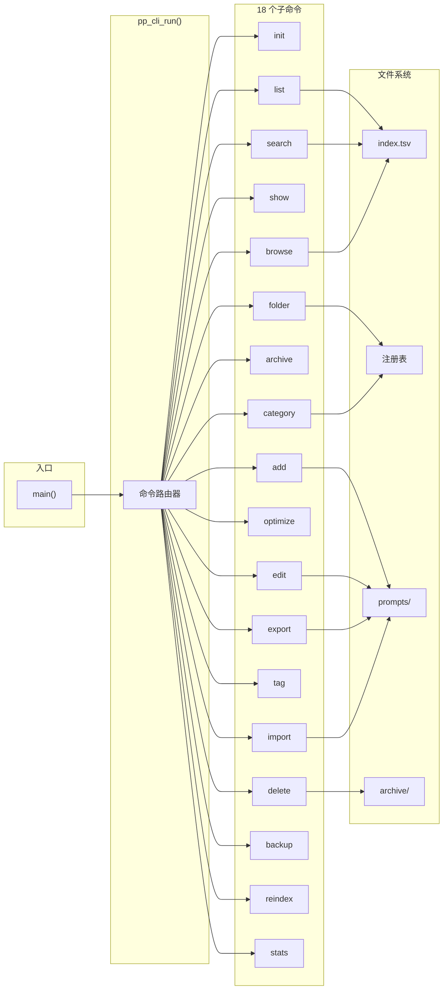
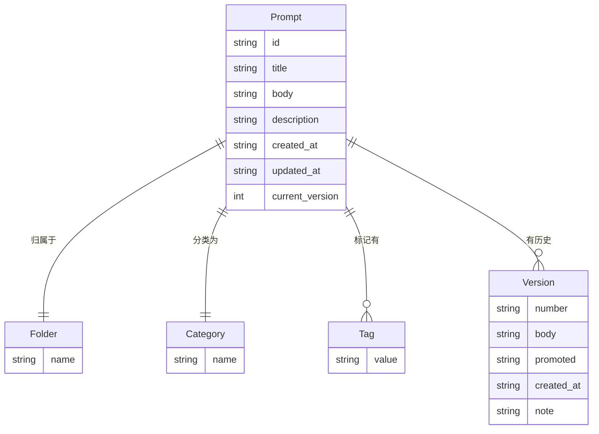
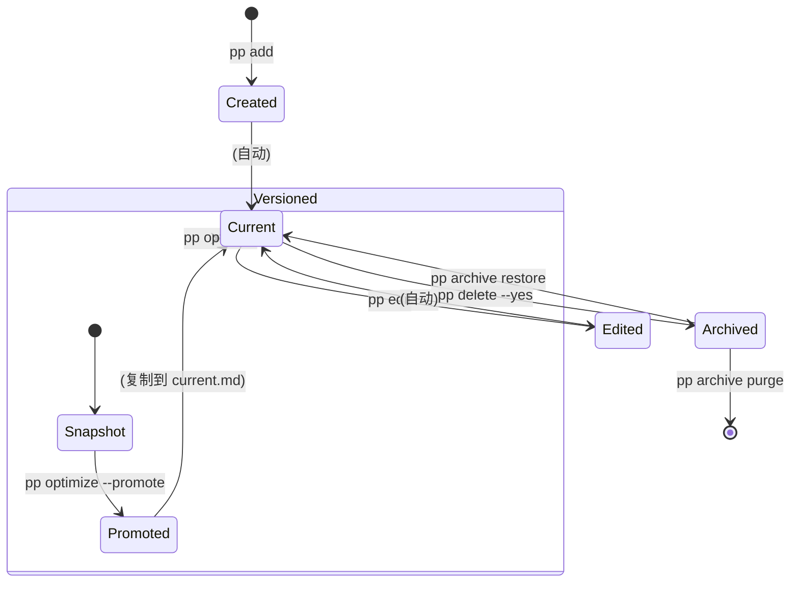
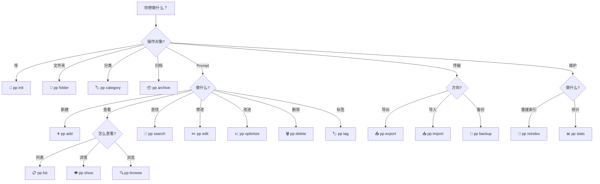
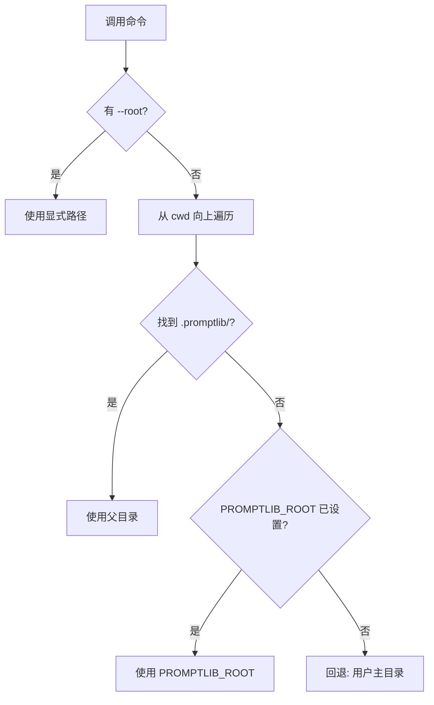
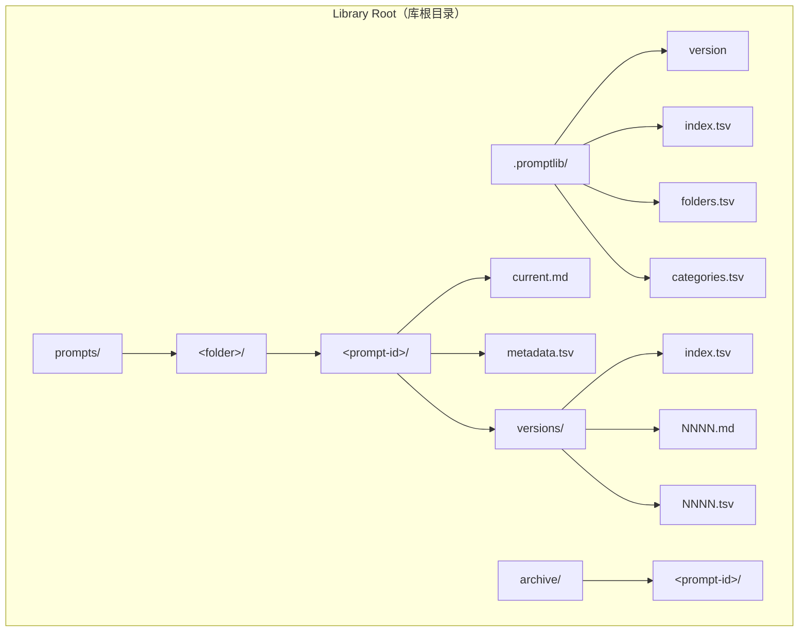

# 软件需求规范 — PromptEditor

**版本:** 1.0 &nbsp;|&nbsp; **日期:** 2026-07-07 &nbsp;|&nbsp; **状态:** 草案

---

## 目录

- [1. 引言](#1-引言)
- [2. 总体描述](#2-总体描述)
- [3. 功能需求](#3-功能需求)
- [4. 存储格式](#4-存储格式)
- [5. 非功能需求](#5-非功能需求)
- [6. 接口规范](#6-接口规范)
- [7. 附录](#7-附录)

---

## 1. 引言

### 1.1 目的

PromptEditor 是一个纯 C11 命令行应用程序，用于在本地文件支持的库中保存、组织、检索、浏览和优化
prompt 模板。本文档定义了 PromptEditor 的功能与非功能需求。

### 1.2 范围

- 一个 CLI 可执行文件 (`pp`)，包含 18 个子命令。
- 一个可通过 CMake `find_package` 安装使用的可复用 C 库 (`prompteditor_core`)。
- 一种人类可读、基于文件的存储格式，无需数据库服务器。
- 跨平台支持 Windows、Linux 和 macOS（MSVC、GCC、Clang、AppleClang）。

### 1.3 系统架构



### 1.4 数据模型



| 关系 | 基数 | 约束 |
|-------------|:---:|------|
| Prompt → Folder | 1:1 | 每个 prompt 恰好属于一个文件夹 |
| Prompt → Category | 1:1 | 每个 prompt 恰好有一个分类 |
| Prompt → Tag | 1:N | 零到多个标签 |
| Prompt → Version | 1:N | 零到多个版本快照 |
| Folder ⊥ Category | 正交 | 独立维度 |

> **💡 设计原理：** 文件夹 = 排他性容器（"存放在哪里"）。分类 = 功能类型（"是什么类型"）。
> 标签 = 交叉主题（"关联什么特征"）。

### 1.5 Prompt 生命周期



### 1.6 术语定义

| 术语 | 定义 |
|------|------|
| Prompt | 文本模板，通过标题标识，附带元数据和版本历史 |
| 库根目录 | 包含 `.promptlib/` 和 `prompts/` 的目录 |
| Prompt ID | slug 化标题 + 4 位十六进制哈希后缀 |
| 文件夹 | 排他性容器；每个 prompt 属于恰好一个 |
| 分类 | 功能类型标签；与文件夹正交 |
| 标签 | 可重复的、逗号分隔的交叉过滤关键词 |
| 注册表 | 以 `.tsv` 存储的名称列表 |
| 索引 | 可重建的 TSV 缓存 |
| 版本 | 通过 `optimize` 创建的编号快照（`NNNN`） |
| 归档 | `archive/` 目录 |

### 1.7 需求格式

| 优先级 | 含义 |
|:--------:|---------|
| 🔴 P0 | 必须实现 — 缺失则系统不可用 |
| 🟡 P1 | 应当实现 — 缺失则显著降低可用性 |
| 🟢 P2 | 可以实现 — 增强功能 |

每条需求以 `###` 标题呈现。正文使用代码块，含标签字段（`Title`、`Desc`、`Given`、`When`、`Then`）。
实现状态集中记录在 [§7.3 已规划需求](#73-已规划需求)，不内联显示。

---

## 2. 总体描述

### 2.1 产品视角

PromptEditor 是独立的 CLI 工具，无网络依赖。完全在本地文件上运行。同时作为可安装的 C 库发布。

### 2.2 用户特征

| 角色 | 描述 |
|------|------|
| **Any User** | 创建、组织和搜索 prompt 模板 |
| **Prompt Author** | 创建和编辑 prompt 内容 |
| **Library Administrator** | 管理文件夹、分类、导出、导入、备份 |
| **Script Author** | 通过 `--json` 或 `--raw` 消费输出 |
| **Downstream Developer** | 链接 `PromptEditor::prompteditor_core` |
| **Build Engineer** | 配置、构建和安装项目 |
| **QA Engineer** | 运行和维护测试套件 |
| **CI System** | 自动化流水线 |
| **System** | 内部验证、完整性、行为 |

### 2.3 运行环境

Windows 10+, Linux (kernel 4.x+), macOS 11+。UTF-8 终端；可选 `fzf` 和 `$EDITOR`。

### 2.4 设计约束

纯 C11，零外部运行时依赖。仅标准 C 库文件 I/O。CMake 3.21+；默认 Ninja。
MSVC 2019+, GCC 8+, Clang 7+, AppleClang。

### 2.5 假设

文件系统支持 POSIX `rename()`（同一卷原子操作）。元数据字段不含制表符、换行符、控制字符。
用户对库根目录有读写权限。

---

## 3. 功能需求

### 命令速查器



### 3.1 全局 CLI 行为

| 标志 | 全局 | 各命令 |
|------|:--:|:--:|
| `-h`, `--help` | ✅ | ✅ |
| `-v`, `--version` | ✅ | — |
| `--root <path>` | — | ✅ |

---

### REQ-F-001 🔴 [Any User]

```
Title  全局帮助
Desc   不带参数或带 -h / --help 运行 pp 打印所有可用命令和全局选项。
Given  以无参数方式调用 pp
When   进程启动
Then   标准输出包含 "Usage: pp <command> [options]" 和 18 个命令以及
       -h, --help / -v, --version；退出码 0
```

---

### REQ-F-002 🔴 [Any User]

```
Title  全局版本标志
Desc   运行 pp -v 或 pp --version 打印 CLI 版本。
Given  以 -v 或 --version 调用 pp
When   参数解析
Then   标准输出包含 "pp <version>"；退出码 0
```

---

### REQ-F-003 🔴 [Any User]

```
Title  未知命令错误
Desc   运行 pp <unknown> 打印错误并以退出码 1 退出。
Given  用户调用 pp nonexistent
When   命令分发器运行
Then   标准错误包含 "Unknown command: nonexistent"；退出码 1
```

---

### REQ-F-004 🟡 [Any User]

```
Title  命令特定帮助
Desc   每个子命令支持 -h / --help 打印自身用法文本。
Given  用户调用 pp add --help
When   参数解析
Then   标准输出包含 add 的用法行、选项列表和描述；退出码 0
```

---

### 3.2 库根目录发现



---

### REQ-F-005 🔴 [Any User]

```
Title  自动发现库根目录
Desc   省略 --root 时从 cwd 向上遍历查找 .promptlib/。
Given  cwd 为 /home/user/projects/my-prompts/notes 且 .promptlib/ 存在于
       /home/user/projects/my-prompts/.promptlib/
When   不带 --root 调用 pp list
Then   库根目录解析为 /home/user/projects/my-prompts
```

---

### REQ-F-006 🔴 [Any User]

```
Title  PROMPTLIB_ROOT 环境变量
Desc   如果向上遍历失败，使用 PROMPTLIB_ROOT 作为库根目录。
Given  PROMPTLIB_ROOT=/custom/prompts 且无 .promptlib/ 发现
When   不带 --root 调用 pp list
Then   库根目录解析为 /custom/prompts
```

---

### REQ-F-007 🔴 [Any User]

```
Title  默认回退到用户主目录
Desc   如以上均未产生根目录，使用用户主目录。init_library() 在其中创建 .promptlib/。
Given  无 .promptlib/ 发现且 PROMPTLIB_ROOT 未设置
When   调用 pp list
Then   库根目录默认为 $HOME（Unix）或 %USERPROFILE%（Windows）
```

---

### REQ-F-008 🔴 [Any User]

```
Title  显式 --root 标志
Desc   --root <path> 覆盖自动发现和环境变量。
Given  pp list --root /explicit/path
When   解析根目录
Then   库根目录为 /explicit/path
```

---

### 3.3 init — 初始化 Prompt 库

| 选项 | 必填 | 默认值 | 描述 |
|--------|:--:|------|------|
| `--root <path>` | 否 | 自动发现 | 库根目录 |

```sh
pp init                          # ~/.promptlib
pp init --root ./my-prompts      # ./my-prompts/.promptlib
```

---

### REQ-F-009 🔴 [Library Administrator]

```
Title  初始化新库
Desc   创建 .promptlib/、prompts/、archive/ 及所有默认元数据文件。
Given  /tmp/mylib 不存在
When   执行 pp init --root /tmp/mylib
Then   创建 .promptlib/version（"1"）、index.tsv（含表头）、folders.tsv
       （"name\ninbox\n"）、categories.tsv（"name\ngeneral\n"）、prompts/、
       archive/；标准输出 "Prompt library ready: /tmp/mylib"；退出码 0
```

---

### REQ-F-010 🟡 [Library Administrator]

```
Title  init 幂等
Desc   再次运行不覆盖已有元数据文件。
Given  /tmp/mylib 已完全初始化
When   再次执行 pp init --root /tmp/mylib
Then   已有文件不变；退出码 0
```

---

### REQ-F-011 🟡 [Library Administrator]

```
Title  init 只创建缺失目录
Desc   部分初始化时只创建缺失的目录。
Given  /tmp/mylib/prompts/ 存在但 .promptlib/ 不存在
When   执行 pp init --root /tmp/mylib
Then   创建 .promptlib/ 和 archive/；prompts/ 不变
```

---

### 3.4 add — 保存 Prompt

| 选项 | 必填 | 默认值 | 备注 |
|--------|:--:|------|-----|
| `--title <text>` | ✅ | — | < 512 字符，不含制表符/换行符 |
| `--body <text>` | * | — | 除非使用 `--editor` |
| `--editor` | 否 | — | 打开 `$EDITOR` |
| `--folder <path>` | 否 | `inbox` | 自动注册 |
| `--category <name>` | 否 | `general` | 自动注册 |
| `--tag <name>` | 否 | — | 可重复 |
| `--description <text>` | 否 | — | 可选 |

> \* 除非使用 `--editor`，否则 `--body` 为必填。

```sh
pp add --title "Summarize" --body "Summarize the following text."
pp add --title "Draft" --editor
pp add --title "Review" --body "..." --folder work --category instruction --tag ai --tag urgent
```

**Prompt ID 生成**：slug 化标题 → 小写字母数字 + 破折号 + djb2 哈希尾 4 位十六进制。

```
"Hello World! 2024"  →  hello-world-2024-a1b2
"!!!"                →  p-c3d4
```

---

### REQ-F-012 🔴 [Prompt Author]

```
Title  添加 prompt
Desc   保存新 prompt，生成稳定 ID 并写入正文、元数据和索引。按 [§3.21] 验证。
Given  已初始化的库和 pp add --title "Hello World" --body "Say hello."
When   命令执行
Then   在 prompts/inbox/<slug>-<hash>/ 创建目录含 current.md 和 metadata.tsv
       （id、title、folder=inbox、category=general、时间戳、current_version=1）；
       index.tsv 追加一行；标准输出 "Saved prompt: <id>"；退出码 0
```

---

### REQ-F-013 🔴 [Prompt Author]

```
Title  缺少 --title
Desc   不带 --title 的 pp add 打印错误并退出码 1。
Given  pp add --body "text" 不带 --title
When   参数解析
Then   标准错误: "Missing required option: --title."；退出码 1
```

---

### REQ-F-014 🔴 [Prompt Author]

```
Title  缺少 --body
Desc   不带 --body 且不带 --editor 的 pp add 打印错误。
Given  pp add --title "Test"
When   参数解析
Then   标准错误: "Missing required option: --body (or use --editor)."；退出码 1
```

---

### REQ-F-015 🟡 [Prompt Author]

```
Title  通过 $EDITOR 添加
Desc   使用预填临时文件打开系统编辑器；保存编辑内容为正文。回退: notepad (Win) / vi (Unix)。
Given  $EDITOR 已设置，pp add --title "Draft" --editor
When   编辑器成功退出
Then   编辑内容保存为正文；退出码 0
```

---

### REQ-F-016 🟡 [Prompt Author]

```
Title  编辑器非零退出
Desc   编辑器返回非零时不保存 prompt。
Given  编辑器以退出码 1 退出
When   spawn_editor 返回
Then   标准错误: "Editor returned non-zero. Content not updated."；不创建 prompt；退出码 1
```

---

### REQ-F-017 🟡 [Prompt Author]

```
Title  使用可选元数据添加
Desc   支持 --folder、--category、--tag（可重复）、--description。
Given  pp add --title "T" --body "B" --folder work --category coding --tag ai
       --tag review --description "A useful prompt"
When   命令执行
Then   Prompt 以 folder="work", category="coding", tags="ai,review",
       description="A useful prompt" 保存；文件夹/分类自动注册
```

---

### REQ-F-018 🔴 [Prompt Author]

```
Title  拒绝重复 ID
Desc   已存在相同自动生成 ID 的 prompt 时添加失败。
Given  已存在标题为 "Hello World" 的 prompt（ID hello-world-xxxx）
When   再次执行 pp add --title "Hello World" --body "B"
Then   标准错误: "Prompt already exists: hello-world-xxxx"；退出码 1
```

---

### REQ-F-019 🔴 [Prompt Author]

```
Title  add 时验证字段
Desc   保存前所有字段按 [§3.21] 验证。
Given  标题超过 511 字符
When   验证运行
Then   标准错误指示不支持的字符；退出码 1；prompt 未创建
```

---

### REQ-F-020 🔴 [System]

```
Title  Prompt ID 生成
Desc   ID 通过对标题进行 slug 化（转为小写字母数字，非字母数字 → "-"，去除首尾连字符），
       再拼接 "-" + djb2 哈希值的末 4 位十六进制数来生成。空 slug → "p"。
Given  标题 "Hello World! 2024" → "hello-world-2024-a1b2"；标题 "!!!" → "p-c3d4"
When   pp add 生成 ID
Then   ID 稳定（相同标题 → 相同 ID）、小写、≤ 128 字符、每个标题唯一
```

---

### REQ-F-021 🔴 [System]

```
Title  默认元数据赋值
Desc   省略 --folder 时默认 "inbox"；省略 --category 时默认 "general"；
       省略标签时默认空；省略描述时默认空。created_at / updated_at 设为当前 UTC 时间戳；
       current_version = 1。
Given  pp add --title "T" --body "B" 不传可选标志
When   prompt 保存
Then   metadata.tsv：folder=inbox、category=general、无 tag 行、无 description 行，
       created_at/updated_at 已填充、current_version=1
```

---

### 3.5 list — 列出 Prompt

| 选项 | 描述 |
|--------|------|
| `--folder <path>` | 按文件夹过滤 |
| `--category <name>` | 按分类过滤 |
| `--tag <name>` | 按标签过滤 |
| `--json` | JSON 数组输出 |
| `--no-pager` | 禁用自动分页 |

```sh
pp list                          # 彩色表格
pp list --folder work --tag urgent  # 组合过滤
pp list --json                      # 机器可读
```

---

### REQ-F-022 🔴 [Any User]

```
Title  表格列出
Desc   打印彩色表格（ID、TITLE、FOLDER、CATEGORY、TAGS）和计数。遵守 NO_COLOR 和自动分页。
Given  库中含 2 个 prompt
When   执行 pp list
Then   表头行 + 分隔行 + 2 数据行 + "2 prompt(s)"；退出码 0
```

---

### REQ-F-023 🟡 [Any User]

```
Title  列表自动分页
Desc   当标准输出为 TTY 时，通过 $PAGER（回退: less -R / more）管道输出。--no-pager 禁用。
Given  标准输出为 TTY 且输出超过一屏
When   不带 --no-pager 执行 pp list
Then   输出通过分页器管道输出
```

---

### REQ-F-024 🟡 [Script Author]

```
Title  JSON 格式列表
Desc   pp list --json 打印 JSON 数组。转义遵循 [REQ-F-092]。
Given  库中有 1 个 prompt
When   执行 pp list --json
Then   标准输出为有效 JSON [{...}]；颜色和分页抑制
```

---

### REQ-F-025 🟡 [Any User]

```
Title  按文件夹过滤列表
Desc   pp list --folder <path> 仅显示指定文件夹中的 prompt。
Given  "inbox" 和 "work" 中存在 prompt
When   pp list --folder work
Then   仅显示 folder="work" 的 prompt
```

---

### REQ-F-026 🟡 [Any User]

```
Title  按分类过滤列表
Desc   pp list --category <name> 仅显示指定分类的 prompt。
Given  "general" 和 "coding" 分类中有 prompt
When   pp list --category coding
Then   仅显示 category="coding" 的 prompt
```

---

### REQ-F-027 🟡 [Any User]

```
Title  按标签过滤列表
Desc   pp list --tag <name> 仅显示具有指定标签的 prompt。
Given  一个 prompt 标签为 "ai,review"，另一个为 "draft"
When   pp list --tag ai
Then   仅显示带 "ai" 标签的 prompt
```

---

### REQ-F-028 🟡 [Any User]

```
Title  组合过滤列表
Desc   多个过滤标志以 AND 逻辑组合。
Given  各种文件夹/分类/标签组合
When   pp list --folder work --tag urgent
Then   仅显示匹配所有过滤条件的 prompt
```

---

### REQ-F-029 🟡 [Any User]

```
Title  列出空库
Desc   库中无 prompt 时显示占位消息。
Given  库中有零个 prompt
When   执行 pp list
Then   标准输出: "(empty)"；退出码 0
--
Given  空库执行 pp list --json
Then   标准输出: "[\n\n]"（空 JSON 数组）；退出码 0
```

---

### 3.6 show — 显示 Prompt

| 选项 | 描述 |
|--------|------|
| `<id-or-title>` | Prompt ID 或精确标题 |
| `--raw` | 仅正文 |
| `--json` | JSON 对象 |

```sh
pp show hello-world-a1b2          # 按 ID
pp show "Hello World"             # 按标题
pp show hello-world-a1b2 --raw    # 仅正文
```

---

### REQ-F-030 🔴 [Any User]

```
Title  按 ID 或标题显示
Desc   显示元数据和正文。先精确 ID 匹配，再精确标题匹配。
Given  存在 ID "hello-world-a1b2" 的 prompt
When   执行 pp show hello-world-a1b2
Then   标准输出含 ID、Title、Folder、Category、Tags、正文、分隔线；退出码 0。
       按标题匹配产生相同输出。
```

---

### REQ-F-031 🔴 [Any User]

```
Title  未找到 prompt
Desc   无匹配时打印错误。
Given  不存在 "nonexistent"
When   执行 pp show nonexistent
Then   标准错误: "Prompt not found: nonexistent"；退出码 1
```

---

### REQ-F-032 🟡 [Script Author]

```
Title  仅显示原始正文
Desc   pp show <id> --raw 仅打印正文文本。
Given  prompt 正文为 "Translate this text."
When   执行 pp show <id> --raw
Then   标准输出仅含 "Translate this text."；退出码 0
```

---

### REQ-F-033 🟡 [Script Author]

```
Title  JSON 格式显示
Desc   pp show <id> --json 打印 JSON 对象。转义遵循 [REQ-F-092]。
Given  prompt 正文含双引号和换行符
When   执行 pp show <id> --json
Then   有效 JSON 含正确转义的特殊字符；退出码 0
```

---

### 3.7 edit — 更新 Prompt

| 选项 | 备注 |
|--------|------|
| `<id-or-title>` | 目标 prompt |
| `--body <text>` | 行内替换正文 |
| `--title <text>` | 替换标题 |
| `--category <name>` | 替换分类 |
| `--folder <path>` | 移动到其他文件夹 |
| `--tag <name>` | 替换所有标签；可重复 |
| `--description <text>` | 替换描述 |

> **编辑器模式**：无标志时打开 `$EDITOR` 编辑当前正文。

```sh
pp edit hello-world-a1b2                            # 编辑器模式
pp edit hello-world-a1b2 --body "Updated text"      # 行内
pp edit hello-world-a1b2 --folder work              # 移动文件夹
pp edit hello-world-a1b2 --tag urgent --tag ai      # 替换标签
```

---

### REQ-F-034 🔴 [Prompt Author]

```
Title  通过 $EDITOR 编辑
Desc   在 $EDITOR 中打开当前正文。成功时替换正文。
Given  prompt 正文为 "Original text"
When   执行 pp edit <id>，编辑器保存 "Updated text"
Then   正文替换；updated_at 刷新；索引更新；标准输出 "Updated prompt: <id>"；退出码 0
```

---

### REQ-F-035 🟡 [Prompt Author]

```
Title  行内编辑正文
Desc   pp edit <id> --body <text> 直接替换正文。
Given  prompt 正文为 "Old"
When   执行 pp edit <id> --body "New"
Then   正文变为 "New"；updated_at 刷新；退出码 0
```

---

### REQ-F-036 🟡 [Prompt Author]

```
Title  编辑元数据字段
Desc   支持 --title、--category、--tag、--description、--folder。按 [§3.21] 验证。
Given  prompt 标题为 "Old Title"，分类为 "general"
When   执行 pp edit <id> --title "New Title" --category "coding"
Then   metadata.tsv 和索引均更新；退出码 0
```

---

### REQ-F-037 🟡 [Prompt Author]

```
Title  标签替换
Desc   --tag 替换所有标签（非追加）。增量操作请用 pp tag add。
Given  prompt 标签为 "ai,review"
When   执行 pp edit <id> --tag urgent
Then   标签变为 "urgent"；退出码 0
```

---

### REQ-F-038 🟡 [Prompt Author]

```
Title  编辑移动文件夹
Desc   pp edit <id> --folder <new-folder> 更新文件夹。新文件夹自动注册。
Given  prompt 在 "inbox" 文件夹中
When   执行 pp edit <id> --folder work
Then   元数据和索引中文件夹更新；退出码 0
```

---

### REQ-F-039 🟡 [Prompt Author]

```
Title  编辑时验证字段
Desc   所有编辑字段按 [§3.21] 验证。
Given  pp edit <id> --folder "../../etc"
When   验证运行
Then   标准错误: "Folder contains unsupported characters."；prompt 不变；退出码 1
```

---

### 3.8 delete — 归档或删除 Prompt

| 选项 | 描述 |
|--------|------|
| `<id-or-title>` | 要删除的 prompt |
| `--yes` | 确认操作 |

```sh
pp delete hello-world-a1b2 --yes
```

---

### REQ-F-040 🔴 [Prompt Author]

```
Title  删除将 prompt 归档
Desc   将 prompt 目录从 prompts/<folder>/<id> 移动到 archive/<id>，从索引中移除。
Given  prompt 存在于 prompts/inbox/summarize-a1b2/
When   执行 pp delete summarize-a1b2 --yes
Then   目录移至 archive/summarize-a1b2/；索引行移除；标准输出 "Archived prompt:
       summarize-a1b2"；退出码 0
```

---

### REQ-F-041 🔴 [Prompt Author]

```
Title  删除需要确认
Desc   不带 --yes 时打印确认消息，不执行删除。
Given  prompt 存在
When   不带 --yes 执行 pp delete <id>
Then   标准错误: "Delete archives prompts. Re-run with --yes to confirm."；退出码 1
```

---

### REQ-F-042 🟡 [Prompt Author]

```
Title  拒绝重复归档
Desc   已存在相同 ID 的归档 prompt 时拒绝删除。
Given  archive/summarize-a1b2/ 已存在
When   执行 pp delete summarize-a1b2 --yes
Then   标准错误: "Archived prompt already exists: summarize-a1b2"；退出码 1
```

---

### 3.9 archive — 管理已归档 Prompt

| 操作 | 语法 | 需要 `--yes` |
|--------|------|:--:|
| `list` | `pp archive list` | — |
| `restore` | `pp archive restore <id>` | — |
| `purge` | `pp archive purge <id> --yes` | ✅ |

```sh
pp archive list
pp archive restore hello-world-a1b2
pp archive purge hello-world-a1b2 --yes
```

---

### REQ-F-125 🟡 [Prompt Author]

```
Title  列出已归档 prompt
Desc   列出 archive/ 中所有 prompt。
Given  3 个 prompt 已归档
When   执行 pp archive list
Then   显示已归档 prompt 表格（ID、标题、归档日期）；退出码 0
```

---

### REQ-F-126 🟡 [Prompt Author]

```
Title  恢复已归档 prompt
Desc   将已归档 prompt 恢复到原文件夹（如不存在则用 inbox），重新加入索引。
Given  已归档 prompt "summarize-a1b2" 在 archive/ 中
When   执行 pp archive restore summarize-a1b2
Then   目录移回 prompts/<folder>/summarize-a1b2/；重新加入 index.tsv；退出码 0
```

---

### REQ-F-127 🟡 [Prompt Author]

```
Title  永久清除已归档 prompt
Desc   从文件系统永久删除已归档 prompt。
Given  已归档 prompt 存在
When   执行 pp archive purge <id> --yes
Then   从 archive/ 永久删除 prompt 目录；退出码 0
```

---

### 3.10 search — 全文搜索

| 选项 | 描述 |
|--------|------|
| `<query>` | 不区分大小写的搜索词 |
| `--folder/category/tag` | 预过滤 |
| `--raw` | 仅正文输出 |

```sh
pp search chinese
pp search "code review" --folder work
pp search chinese --raw
```

---

### REQ-F-044 🔴 [Any User]

```
Title  跨所有字段搜索
Desc   在 ID、标题、文件夹、分类、标签和正文中进行不区分大小写的子串匹配。
Given  标题为 "Translate to Chinese" 的 prompt 和正文含 "Chinese" 的 prompt
When   执行 pp search chinese
Then   两个 prompt 均列出；退出码 0
```

---

### REQ-F-045 🟡 [Any User]

```
Title  搜索原始输出
Desc   pp search <query> --raw 仅打印匹配正文。
Given  2 个 prompt 匹配
When   执行 pp search <query> --raw
Then   标准输出仅含正文文本；退出码 0
```

---

### REQ-F-046 🟡 [Any User]

```
Title  搜索带过滤器
Desc   支持 --folder、--category、--tag 预过滤。
Given  "inbox" 和 "work" 中均有匹配 prompt
When   执行 pp search test --folder work
Then   仅显示 "work" 匹配项
```

---

### REQ-F-047 🟡 [Any User]

```
Title  搜索无结果
Desc   无匹配时打印 "No prompts found."（raw 模式抑制）。
Given  无 prompt 含 "xyznonexistent"
When   执行 pp search xyznonexistent
Then   "No prompts found."；退出码 0
```

---

### 3.11 browse — 交互式 Prompt 浏览器

| 选项 | 描述 |
|--------|------|
| `--folder/category/tag` | 预过滤 |

```sh
pp browse
pp browse --folder work
```

---

### REQ-F-048 🔴 [Any User]

```
Title  使用 fzf 浏览
Desc   PATH 中有 fzf 时启动交互式模糊查找器，预览窗口显示 pp show --raw 输出。
Given  PATH 中有 fzf 且库中有 prompt
When   执行 pp browse
Then   fzf 启动含标题和预览；退出码 0
```

---

### REQ-F-049 🔴 [Any User]

```
Title  编号菜单回退
Desc   fzf 不可用时显示编号列表。输入数字查看，'e' 编辑，'q' 退出。
Given  PATH 中无 fzf，库中有 3 个 prompt
When   执行 pp browse
Then   显示编号列表和 "> " 提示符；输入 "1" 显示该 prompt；"q" 退出；退出码 0
```

---

### REQ-F-050 🟡 [Any User]

```
Title  浏览器过滤器
Desc   支持 --folder、--category、--tag 预过滤。
Given  多个文件夹中有 prompt
When   执行 pp browse --folder work
Then   仅显示 "work" 文件夹的 prompt
```

---

### REQ-F-051 🟡 [Any User]

```
Title  浏览器编辑快捷键
Desc   编号菜单模式中查看后按 'e' 编辑。
Given  编号菜单显示 prompt
When   用户按 'e'
Then   调用 pp edit <id>，编辑后返回浏览器
```

---

### 3.12 optimize — Prompt 版本管理

| 选项 | 备注 |
|--------|------|
| `<id-or-title>` | 目标 prompt |
| `--body <text>` | 必填 * |
| `--note <text>` | 变更说明 |
| `--promote` | 设为当前版本 |
| `--history` | 列出所有版本 |
| `--compare <version>` | 与版本对比 |

> \* 除非使用 `--history` 或 `--compare`，否则为必填。

```sh
pp optimize hello-world-a1b2 --body "Better version" --note "Improved clarity"
pp optimize hello-world-a1b2 --body "Final" --promote
pp optimize hello-world-a1b2 --history
pp optimize hello-world-a1b2 --compare 0002
```

---

### REQ-F-052 🔴 [Prompt Author]

```
Title  创建优化版本
Desc   在 versions/ 下创建新版本快照，不修改 current.md。
Given  当前版本 1（正文 "Original"）
When   执行 pp optimize <id> --body "Improved" --note "Better wording"
Then   versions/0002.md="Improved"；versions/index.tsv 追加；current.md 不变；
       标准输出 "Created optimized version: 0002"；退出码 0
```

---

### REQ-F-053 🔴 [Prompt Author]

```
Title  optimize 需要 --body
Desc   不带 --body、--history 或 --compare 时报错。
Given  执行 pp optimize <id> 不带任何操作标志
When   参数解析
Then   标准错误: "Missing required option: --body."；退出码 1
```

---

### REQ-F-054 🟡 [Prompt Author]

```
Title  晋升版本
Desc   --promote 创建版本并复制到 current.md。
Given  当前版本 1
When   执行 pp optimize <id> --body "Promoted" --promote
Then   current.md="Promoted"；current_version=0002；标准输出 "Created and promoted
       optimized version: 0002"；退出码 0
```

---

### REQ-F-055 🟡 [Prompt Author]

```
Title  显示版本历史
Desc   pp optimize <id> --history 打印 versions/index.tsv。
Given  版本 0002、0003 存在
When   执行 pp optimize <id> --history
Then   标准输出含版本行。无版本时: "No optimized versions found."
```

---

### REQ-F-056 🟡 [Prompt Author]

```
Title  版本对比
Desc   pp optimize <id> --compare <version> 打印当前正文和指定版本。
Given  当前正文 "Current"，版本 0002 正文 "Version 2"
When   执行 pp optimize <id> --compare 0002
Then   标准输出包含两个正文；退出码 0
```

---

### REQ-F-057 🟡 [Prompt Author]

```
Title  自动递增版本号
Desc   版本号从最高存在自动递增。首个为 0002。
Given  版本 0002、0003 存在
When   执行 pp optimize <id> --body "New"
Then   新版本为 0004
```

---

### 3.13 folder — 管理文件夹

| 操作 | 语法 | 需要 `--yes` |
|--------|------|:--:|
| `list` | `pp folder list` | — |
| `create` | `pp folder create <name>` | — |
| `remove` | `pp folder remove <name> --yes` | ✅ |
| `rename` | `pp folder rename <name> --to <new>` | — |

---

### REQ-F-059 🔴 [Library Administrator]

```
Title  列出文件夹
Desc   打印所有已注册文件夹名称。
Given  "inbox" 和 "work" 存在
When   执行 pp folder list
Then   标准输出: "name"、"inbox"、"work"；退出码 0
```

---

### REQ-F-060 🔴 [Library Administrator]

```
Title  创建文件夹
Desc   添加新文件夹名；幂等。按 [REQ-F-091] 验证。
Given  文件夹 "projects" 不存在
When   执行 pp folder create projects
Then   "projects" 追加到 folders.tsv；标准输出 "Created folder: projects"；退出码 0
```

---

### REQ-F-062 🔴 [Library Administrator]

```
Title  删除文件夹
Desc   仅当无 prompt 引用时从注册表删除。
Given  "empty-folder" 无 prompt 使用
When   执行 pp folder remove empty-folder --yes
Then   标准输出 "Removed folder: empty-folder"；退出码 0
--
Given  "inbox" 有 prompt 使用
When   执行 pp folder remove inbox --yes
Then   标准错误 "Cannot remove folder 'inbox' while prompts still use it."；退出码 1
```

---

### REQ-F-063 🔴 [Library Administrator]

```
Title  删除需要确认
Desc   不带 --yes 打印确认消息。
Given  文件夹 "test" 存在
When   不带 --yes 执行 pp folder remove test
Then   标准错误 "Re-run with --yes to remove folder 'test'."；退出码 1
```

---

### REQ-F-064 🟡 [Library Administrator]

```
Title  重命名文件夹
Desc   在注册表中重命名，更新所有引用 prompt，重命名磁盘目录。
Given  文件夹 "old-name" 含 prompt 和 prompts/old-name/
When   执行 pp folder rename old-name --to new-name
Then   注册表、索引、元数据和目录均更新；退出码 0
```

---

### REQ-F-065 🔴 [Library Administrator]

```
Title  验证文件夹名称
Desc   按 [REQ-F-091] 验证。
Given  pp folder create "../escape"
When   验证运行
Then   标准错误 "folder name contains unsupported characters."；退出码 1
```

---

### 3.14 category — 管理分类

| 操作 | 语法 | 需要 `--yes` |
|--------|------|:--:|
| `list` | `pp category list` | — |
| `create` | `pp category create <name>` | — |
| `remove` | `pp category remove <name> --yes` | ✅ |
| `rename` | `pp category rename <name> --to <new>` | — |

---

### REQ-F-066 🔴 [Library Administrator]

```
Title  列出分类
Desc   打印所有已注册分类名称。
Given  已初始化的库
When   执行 pp category list
Then   标准输出: "name"、"general"（及已注册的）；退出码 0
```

---

### REQ-F-067 🔴 [Library Administrator]

```
Title  创建分类
Desc   添加新分类；幂等。按 [REQ-F-086] 验证。
Given  分类 "writing" 不存在
When   执行 pp category create writing
Then   标准输出 "Created category: writing"；退出码 0
```

---

### REQ-F-068 🔴 [Library Administrator]

```
Title  删除分类
Desc   仅当无 prompt 引用时从注册表删除。
Given  "obsolete" 无 prompt
When   执行 pp category remove obsolete --yes
Then   标准输出 "Removed category: obsolete"；退出码 0
--
Given  "general" 正在使用
When   执行 pp category remove general --yes
Then   标准错误 "Cannot remove category 'general' while prompts still use it."；退出码 1
```

---

### REQ-F-069 🟡 [Library Administrator]

```
Title  重命名分类
Desc   在注册表中重命名并更新所有引用 prompt。
Given  分类 "ai" 被 3 个 prompt 使用
When   执行 pp category rename ai --to artificial-intelligence
Then   注册表更新；3 个 prompt 均更新；标准输出 "Renamed category: ai ->
       artificial-intelligence"；退出码 0
```

---

### REQ-F-070 🔴 [Library Administrator]

```
Title  验证分类名称
Desc   按 [REQ-F-086] 验证。
Given  pp category create "cat\twith\ttab"
When   验证运行
Then   标准错误指示不支持的字符；退出码 1
```

---

### 3.15 tag — 增量标签管理

| 操作 | 语法 | 描述 |
|--------|------|------|
| `add` | `pp tag add <id> <tag>` | 追加标签（存在则无操作） |
| `remove` | `pp tag remove <id> <tag>` | 移除单个标签 |
| `list` | `pp tag list <id>` | 列出所有标签 |

与 `pp edit --tag`（替换全部）不同，`pp tag` 操作单个标签。

```sh
pp tag add hello-world-a1b2 urgent
pp tag remove hello-world-a1b2 draft
pp tag list hello-world-a1b2
```

---

### REQ-F-128 🟡 [Prompt Author]

```
Title  添加标签
Desc   追加单个标签。已存在则幂等。按 [REQ-F-089] 验证。
Given  prompt 标签为 "ai,review"
When   执行 pp tag add <id> urgent
Then   标签变为 "ai,review,urgent"；索引和元数据更新；退出码 0
--
Given  "urgent" 标签已存在
When   执行 pp tag add <id> urgent
Then   标签不变；成功退出
```

---

### REQ-F-129 🟡 [Prompt Author]

```
Title  移除标签
Desc   移除单个标签。不存在则无操作。
Given  prompt 标签为 "ai,review,urgent"
When   执行 pp tag remove <id> review
Then   标签变为 "ai,urgent"；索引和元数据更新；退出码 0
```

---

### REQ-F-130 🟡 [Any User]

```
Title  列出 prompt 的标签
Desc   每行一个打印指定 prompt 的所有标签。
Given  prompt 标签为 "ai,review,urgent"
When   执行 pp tag list <id>
Then   标准输出: "ai\nreview\nurgent\n"；退出码 0
```

---

### 3.16 export — 导出 Prompt

| 选项 | 必填 | 描述 |
|--------|:--:|------|
| `--out <path>` | ✅ | 目标 |
| `--folder <path>` | 否 | 按文件夹过滤 |

```sh
pp export --out /tmp/exported
pp export --out /tmp/exported --folder work
```

---

### REQ-F-071 🔴 [Library Administrator]

```
Title  导出所有 prompt
Desc   在目标创建新库，包含所有 prompt、元数据和版本。
Given  库中有 3 个 prompt
When   执行 pp export --out /tmp/exported
Then   /tmp/exported/ 为有效库；标准输出 "Exported prompts: 3"；退出码 0
```

---

### REQ-F-072 🔴 [Library Administrator]

```
Title  导出拒绝覆盖
Desc   输出目录已存在时导出失败。
Given  /tmp/exported 已存在
When   执行 pp export --out /tmp/exported
Then   标准错误 "Output directory already exists: /tmp/exported"；退出码 1
```

---

### REQ-F-073 🟡 [Library Administrator]

```
Title  按文件夹过滤导出
Desc   pp export --out <path> --folder <path> 仅导出该文件夹的 prompt。
Given  "inbox" 和 "work" 中有 prompt
When   执行 pp export --out /tmp/exported --folder work
Then   仅导出 "work" prompt
```

---

### 3.17 import — 导入 Prompt

| 选项 | 必填 | 默认值 | 描述 |
|--------|:--:|------|------|
| `<source-path>` | ✅ | — | 源库 |
| `--on-conflict` | 否 | `skip` | `skip` 或 `replace` |

```sh
pp import /tmp/source
pp import /tmp/source --on-conflict replace
```

---

### REQ-F-076 🔴 [Library Administrator]

```
Title  导入 prompt
Desc   导入所有 prompt（含正文、元数据、版本）。源必须是有效库（[REQ-F-079]）。
Given  源 /tmp/source 有 2 个 prompt
When   执行 pp import /tmp/source
Then   两个 prompt 复制；索引追加；文件夹/分类自动注册；标准输出 "Imported prompts: 2"；
       退出码 0
```

---

### REQ-F-077 🔴 [Library Administrator]

```
Title  冲突时跳过导入
Desc   默认 --on-conflict skip：跳过已存在 ID 的 prompt。
Given  "hello-a1b2" 在目标和源中均存在
When   执行 pp import /tmp/source
Then   已有 prompt 不变；源 prompt 跳过；"Skipped prompts: 1"；退出码 0
```

---

### REQ-F-078 🟡 [Library Administrator]

```
Title  冲突时替换导入
Desc   --on-conflict replace 覆盖已有 prompt。
Given  "hello-a1b2" 在目标中存在
When   执行 pp import /tmp/source --on-conflict replace
Then   正文、元数据、版本被替换；计入已导入；退出码 0
```

---

### REQ-F-079 🟡 [Library Administrator]

```
Title  导入验证源
Desc   源必须是有效库根目录（含 .promptlib/index.tsv）。
Given  /tmp/not-a-library 无 .promptlib/index.tsv
When   执行 pp import /tmp/not-a-library
Then   标准错误指示无效根目录；退出码 1
```

---

### 3.18 backup — 创建完整备份

| 选项 | 必填 | 描述 |
|--------|:--:|------|
| `--out <path>` | ✅ | 目标 |

```sh
pp backup --out /tmp/backup-2026-07-07
```

---

### REQ-F-081 🔴 [Library Administrator]

```
Title  备份整个库
Desc   等同于无过滤的 pp export --out <path>。
Given  库中含 10 个 prompt 分布在多个文件夹
When   执行 pp backup --out /tmp/backup
Then   /tmp/backup/ 为完整可恢复副本；退出码 0
```

---

### 3.19 reindex — 重建 Prompt 索引

| 选项 | 必填 | 描述 |
|--------|:--:|------|
| `--root <path>` | 否 | 库根目录 |
| `--dry-run` | 否 | 预览变更不写入 |

```sh
pp reindex
pp reindex --dry-run
```

---

### REQ-F-131 🔴 [System]

```
Title  从元数据重建索引
Desc   扫描 prompts/ 下所有 metadata.tsv，重新生成 index.tsv。缺失 metadata.tsv →
       警告并跳过。实现 [REQ-F-083]。
Given  index.tsv 有过时或错误条目
When   执行 pp reindex
Then   index.tsv 重新生成，每个有效 prompt 恰好一行；打印摘要；退出码 0
```

---

### REQ-F-132 🟡 [Library Administrator]

```
Title  重建索引预演
Desc   pp reindex --dry-run 打印差异不写入磁盘。
Given  index.tsv 有 5 行但只有 3 个有效 prompt 目录
When   执行 pp reindex --dry-run
Then   标准输出列出将删除的 2 行和缺失项；index.tsv 不变；退出码 0
```

---

### 3.20 stats — 库统计信息

| 选项 | 描述 |
|--------|------|
| `--json` | JSON 对象输出 |

```sh
pp stats
pp stats --json
```

---

### REQ-F-133 🟢 [Any User]

```
Title  显示库统计信息
Desc   显示：prompt 数、文件夹数、分类数、唯一标签数、版本快照数、归档数、磁盘使用。
Given  库中有 47 prompt、5 文件夹、3 分类、12 标签、8 版本、3 归档
When   执行 pp stats
Then   格式化摘要含所有计数和磁盘使用；退出码 0
--
Given  执行 pp stats --json
Then   有效 JSON: {prompts, folders, categories, tags, versions, archived,
       disk_usage_bytes}
```

---

### 3.21 验证规则

> **💡 设计原理：** 所有用户提供的值在写入磁盘前通过通用验证层，确保所有命令的一致性。

---

### REQ-F-082 🔴 [System]

```
Title  原子文件写入
Desc   所有替换已有内容的文件写入使用"先写临时文件再 rename"模式。
Given  对 current.md 执行文件写入
When   写入执行
Then   内容先写 current.md.tmp；成功后通过 rename() 替换原文件
```

---

### REQ-F-083 🔴 [System]

```
Title  索引可重建
Desc   index.tsv 是缓存；每 prompt 的 metadata.tsv 为数据源。重建命令见 [REQ-F-131]。
Given  index.tsv 被删除
When   执行 pp reindex
Then   从各 metadata.tsv 恢复所有元数据
```

---

### REQ-F-084 🟡 [System]

```
Title  元数据必需键
Desc   每个 metadata.tsv 必须含：id、title、folder、category、created_at、
       updated_at、current_version。可选：tag、description。
```

---

### REQ-F-085 🟡 [System]

```
Title  注册表表头保持
Desc   folders.tsv 和 categories.tsv 首行为 "name"；操作保持表头。
```

---

### REQ-F-086 🔴 [System]

```
Title  不支持字符拒绝
Desc   元数据字段不得包含 \t、\n 或 \r。
Given  pp add --title "Title\nWith\nNewlines" --body "B"
When   验证运行
Then   命令失败；标准错误指示不支持的字符
```

---

### REQ-F-087 🔴 [System]

```
Title  字段长度限制
Desc   元数据字段必须 < 512 字符（PP_FIELD_MAX）。
Given  标题 512+ 字符
When   调用 pp add
Then   命令因验证错误失败
```

---

### REQ-F-088 🔴 [System]

```
Title  正文长度限制
Desc   正文必须 < 65536 字符（PP_BODY_MAX）。
Given  正文超过 65535 字符
When   读/写操作
Then   内容截断或操作优雅失败
```

---

### REQ-F-089 🔴 [System]

```
Title  标签逗号限制
Desc   单个标签值不得包含逗号（逗号 = 索引中列表分隔符）。
Given  pp add --title "T" --body "B" --tag "ai,review"
When   验证运行
Then   标准错误: "Tag contains unsupported characters."；退出码 1
```

---

### REQ-F-090 🔴 [System]

```
Title  版本名格式
Desc   版本名必须精确为 4 位十进制数字（0002–9999）。
Given  "abc" → 返回 0（无效）；"0002" → 返回 1（有效）
```

---

### REQ-F-091 🔴 [System]

```
Title  文件夹路径安全性
Desc   文件夹路径不得包含 ..，不得以 / 或 \ 开头，不得包含 :。
Given  pp add --title "T" --body "B" --folder "../../escape"
When   调用 path_has_unsafe_segment
Then   返回 1（不安全）；命令失败
```

---

### 3.22 JSON 输出

### REQ-F-092 🟡 [Script Author]

```
Title  JSON 字符串转义
Desc   转义 "、\、\n、\t、\r；跳过 0x20 以下的控制字符。
Given  正文含 He said "hello" 和换行符
When   执行 pp show <id> --json
Then   body 字段为 "He said \"hello\"\n..."；JSON 整体有效
```

---

### REQ-F-093 🟡 [Script Author]

```
Title  列表 JSON 有效数组
Desc   pp list --json 产生有效 JSON 数组。
Given  0 个 prompt → [\n\n]；2 个 → 含 2 对象的有效数组
```

---

### 3.23 终端输出

### REQ-F-094 🟡 [System]

```
Title  NO_COLOR 合规
Desc   设置 NO_COLOR 时禁止 ANSI 转义序列。
Given  NO_COLOR=1 且 stdout 为 TTY
When   执行 pp list
Then   输出不含 \x1b[... 序列
```

---

### REQ-F-095 🟡 [System]

```
Title  非 TTY 时无颜色
Desc   输出重定向时抑制颜色代码。
Given  stdout 为普通文件
When   执行 pp list > output.txt
Then   output.txt 不含 ANSI 转义序列
```

---

### 3.24 环境变量

| 变量 | 用途 | 回退 |
|----------|---------|----------|
| `PROMPTLIB_ROOT` | 默认库根目录 | 用户主目录 |
| `EDITOR` | 正文编辑器 | `notepad` / `vi` |
| `PAGER` | 长输出分页器 | `more` / `less -R` |
| `NO_COLOR` | 禁用 ANSI 颜色 |（启用） |

### REQ-F-096 🔴 [System] — PROMPTLIB_ROOT — 见 [REQ-F-006]。

### REQ-F-097 🟡 [System] — EDITOR — 见 [REQ-F-015]。

### REQ-F-098 🟡 [System] — PAGER — 见 [REQ-F-023]。

### REQ-F-099 🟡 [System] — NO_COLOR — 见 [REQ-F-094]。

---

### 3.25 公共 C API

### REQ-F-100 🔴 [Downstream Developer]

```
Title  库版本查询
Desc   pp_version() 返回 {major, minor, patch}。
Given  库以 0.1.0 编译 → {0, 1, 0}
```

---

### REQ-F-101 🔴 [Downstream Developer]

```
Title  带检查的整数加法
Desc   pp_add_checked(a, b, &result) 成功返回 1，溢出或 NULL 返回 0。
Given  pp_add_checked(2, 3, &v) → 1，v=5
Given  pp_add_checked(INT_MAX, 1, &v) → 0（溢出）
```

---

### REQ-F-102 🟡 [Downstream Developer]

```
Title  平台名称
Desc   pp_platform_name() 返回 "windows"、"macos"、"linux" 或 "unknown"。
```

---

### REQ-F-103 🔴 [Downstream Developer]

```
Title  C++ 头文件兼容
Desc   所有公共头文件以 extern "C" 包裹。C++ 包含不产生链接错误。
```

---

### REQ-F-104 🟡 [Downstream Developer]

```
Title  Windows DLL 导出
Desc   BUILD_SHARED_LIBS=ON + _WIN32：__declspec(dllexport/dllimport)。
```

---

### 3.26 构建系统

### REQ-F-105 🔴 [Build Engineer]

```
Title  Ninja CMake 预设
Desc   提供 ninja-debug、ninja-release、ninja-shared、ninja-asan、ninja-coverage。
```

### REQ-F-106 🔴 [Build Engineer]

```
Title  生成器中立预设
Desc   debug、release、shared、asan、coverage 预设可配合任意 CMake 生成器。
```

### REQ-F-107 🔴 [Build Engineer]

```
Title  可安装 CMake 包
Desc   cmake --install → 下游可 find_package(PromptEditor CONFIG REQUIRED)。
```

### REQ-F-108 🟡 [Build Engineer]

```
Title  顶层选项默认为 ON
Desc   PP_BUILD_EXAMPLE、PP_BUILD_TESTING、PP_INSTALL 顶层构建默认 ON。
```

### REQ-F-109 🟡 [Build Engineer]

```
Title  子项目选项默认为 OFF
Desc   同一选项通过 add_subdirectory() 包含时默认 OFF。
```

### REQ-F-110 🟡 [Build Engineer]

```
Title  Sanitizer 支持
Desc   PP_ENABLE_ASAN / PP_ENABLE_UBSAN 在支持的编译器上启用。
```

### REQ-F-111 🟡 [Build Engineer]

```
Title  Coverage 支持
Desc   PP_ENABLE_COVERAGE 在 GCC/Clang 上添加 --coverage。
```

### REQ-F-112 🟡 [Build Engineer]

```
Title  编译器警告
Desc   MSVC: /W4 /permissive-。GCC/Clang: -Wall -Wextra -Wpedantic -Wshadow -Wconversion。
```

### REQ-F-113 🔴 [Build Engineer]

```
Title  C11 标准
Desc   target_compile_features(... c_std_11) 目标级要求，传播至下游。
```

---

### 3.27 测试

### REQ-F-114 🔴 [QA Engineer]

```
Title  通过 CTest 的单元测试
Desc   ctest --preset ninja-debug 执行所有测试。
```

### REQ-F-115 🔴 [QA Engineer]

```
Title  包烟测试
Desc   tests/package_smoke/ 验证 find_package 从 C 和 C++ 消费。
```

### REQ-F-116 🔴 [QA Engineer]

```
Title  子项目烟测试
Desc   tests/subproject_smoke/ 验证 add_subdirectory() 且选项默认 OFF。
```

### REQ-F-117 🟡 [QA Engineer]

```
Title  测试断言辅助
Desc   PP_EXPECT_TRUE / PP_EXPECT_INT_EQ 宏，失败时打印文件和行号。
```

---

### 3.28 静态分析

### REQ-F-118 🟡 [CI System]

```
Title  clang-format 合规
Desc   C 文件通过 clang-format --dry-run --Werror。
```

### REQ-F-119 🟡 [CI System]

```
Title  clang-tidy 分析
Desc   源文件使用 .clang-tidy 配置通过 clang-tidy。
```

### REQ-F-120 🟡 [CI System]

```
Title  cppcheck 分析
Desc   源文件通过 cppcheck --std=c11 --enable=warning,performance,portability。
```

### REQ-F-121 🟡 [CI System]

```
Title  YAML 校验
Desc   CI YAML 文件通过 yamllint。
```

---

## 4. 存储格式



- **index.tsv**：`id\ttitle\tfolder\tcategory\ttags\tupdated_at`（标签逗号分隔）
- **metadata.tsv**：必需 `id`、`title`、`folder`、`category`、`created_at`、`updated_at`、
  `current_version`；可选 `tag`、`description`
- **版本模型**：隐式 v1；`optimize` 从 `0002` 开始自动递增

---

## 5. 非功能需求

| ID | 优先级 | 类别 | 需求 |
|----|:--:|------|------|
| NFR-001 | 🔴 | 可移植性 | Win 10+, Linux 4.x+, macOS 11+ |
| NFR-002 | 🔴 | 可移植性 | MSVC 2019+, GCC 8+, Clang 7+, AppleClang |
| NFR-003 | 🔴 | 可移植性 | 标准 C11 + POSIX；`#ifdef _WIN32` 隔离 |
| NFR-004 | 🟡 | 性能 | 列出 10,000 prompt ≤ 2 秒 |
| NFR-005 | 🟡 | 性能 | 搜索 10,000 prompt ≤ 5 秒 |
| NFR-006 | 🟡 | 性能 | 二进制 ≤ 500 KB（strip） |
| NFR-007 | 🔴 | 依赖 | `pp` 除 libc 外零外部运行时依赖 |
| NFR-008 | 🔴 | 依赖 | `prompteditor_core` 零外部链接时依赖 |
| NFR-009 | 🟡 | 安全性 | 文件写入使用原子 rename |
| NFR-010 | 🟡 | 安全性 | 路径验证防止目录遍历 |
| NFR-011 | 🟡 | 安全性 | `$EDITOR` / `$PAGER` 外不执行 shell |
| NFR-012 | 🟡 | 可用性 | 错误消息含可操作指导 |
| NFR-013 | 🟡 | 可用性 | 每个命令可通过 `-h` / `--help` 获取帮助 |
| NFR-014 | 🟡 | 可用性 | JSON 输出有效且可解析 |
| NFR-015 | 🟡 | 可维护性 | CLI 为可复用库之上的薄分发层 |
| NFR-016 | 🟡 | 可维护性 | 公共头文件稳定且 C++ 兼容 |
| NFR-017 | 🟡 | 可维护性 | 实现细节不进入 `include/` |

---

## 6. 接口规范

### 6.1 命令行接口

`int main(int argc, char **argv)` → `int pp_cli_run(int argc, char **argv)`

| 退出码 | 含义 |
|:--:|------|
| 0 | 成功 |
| 1 | 错误 |
| 2 | 已规划但未实现 |

### 6.2 公共 C API

```c
typedef struct PP_Version { int major; int minor; int patch; } PP_Version;
PP_API PP_Version pp_version(void);
PP_API int        pp_add_checked(int left, int right, int *out_value);
PP_API const char *pp_platform_name(void);
```

### 6.3 环境变量

| 变量 | 用途 | 回退 |
|----------|---------|----------|
| `PROMPTLIB_ROOT` | 默认根目录 | 用户 HOME |
| `EDITOR` | 正文编辑器 | `notepad` / `vi` |
| `PAGER` | 长输出分页器 | `more` / `less -R` |
| `NO_COLOR` | 禁用颜色 |（启用） |

### 6.4 CMake

**目标**: `PromptEditor::prompteditor_core`

| 选项 | 顶层 | 子项目 |
|--------|:--:|:--:|
| `PP_BUILD_EXAMPLE` | ON | OFF |
| `PP_BUILD_TESTING` | ON | OFF |
| `PP_INSTALL` | ON | OFF |
| `PP_ENABLE_ASAN` | OFF | OFF |
| `PP_ENABLE_UBSAN` | OFF | OFF |
| `PP_ENABLE_COVERAGE` | OFF | OFF |

---

## 7. 附录

### 7.1 需求汇总

| 编号范围 | 章节 | 数量 |
|-------|------|:--:|
| 001–004 | 全局 CLI | 4 |
| 005–008 | 根目录发现 | 4 |
| 009–011 | init | 3 |
| 012–021 | add | 10 |
| 022–029 | list | 8 |
| 030–033 | show | 4 |
| 034–039 | edit | 6 |
| 040–042 | delete | 3 |
| 125–127 | archive | 3 |
| 044–047 | search | 4 |
| 048–051 | browse | 4 |
| 052–057 | optimize | 6 |
| 059–065 | folder | 7 |
| 066–070 | category | 5 |
| 128–130 | tag | 3 |
| 071–073 | export | 3 |
| 076–079 | import | 4 |
| 081 | backup | 1 |
| 131–132 | reindex | 2 |
| 133 | stats | 1 |
| 082–091 | 验证 | 10 |
| 092–093 | JSON | 2 |
| 094–095 | 终端 | 2 |
| 096–099 | 环境变量 | 4 |
| 100–104 | C API | 5 |
| 105–113 | 构建 | 9 |
| 114–117 | 测试 | 4 |
| 118–121 | 静态分析 | 4 |
| **总计** | | **136** |

### 7.2 按角色的需求视图

| 角色 | 需求编号 | 数量 |
|------|---------|:--:|
| **Any User** | 001–008, 022–033, 044–051, 130, 133 | 31 |
| **Prompt Author** | 012–019, 030–058, 125–129 | 32 |
| **Library Administrator** | 009–011, 059–081, 132 | 25 |
| **System** | 020–021, 082–099, 131 | 21 |
| **Build Engineer** | 105–113 | 9 |
| **Script Author** | 024, 032–033, 045, 092–093 | 6 |
| **Downstream Developer** | 100–104 | 5 |
| **QA Engineer** | 114–117 | 4 |
| **CI System** | 118–121 | 4 |

### 7.3 已规划需求

以下需求已写入规范但从当前发布中延后：

| ID | 优先级 | 命令 | 标题 |
|----|:--:|------|------|
| REQ-F-043 | 🟢 | delete | 永久删除 (`--permanent`) |
| REQ-F-058 | 🟢 | optimize | 从文件优化正文 (`--file`) |
| REQ-F-074 | 🟢 | export | 按分类导出 |
| REQ-F-075 | 🟢 | export | 压缩归档导出 |
| REQ-F-080 | 🟢 | import | 导入冲突重命名 |

> **说明：** REQ‑F‑125 至 REQ‑F‑133（`archive`、`tag`、`reindex`、`stats` 命令）
> 分别在 §3.9、§3.15、§3.19 和 §3.20 中定义。其 ID 非连续编号，因为它们
> 是在最初 121 条需求的基准上新增的扩展需求。

### 7.4 可追溯性矩阵

- `docs/mvp.md` — 功能规范
- `docs/storage-format.md` — 存储布局
- `src/cli.c` — 已实现的行为
- `include/prompteditor/example.h` — 公共 API
- `CMakeLists.txt`、`cmake/*.cmake` — 构建
- `C_PROJECT_STANDARD.md` — 工程标准
- `.github/workflows/` — CI/CD
- `tests/` — 测试覆盖
